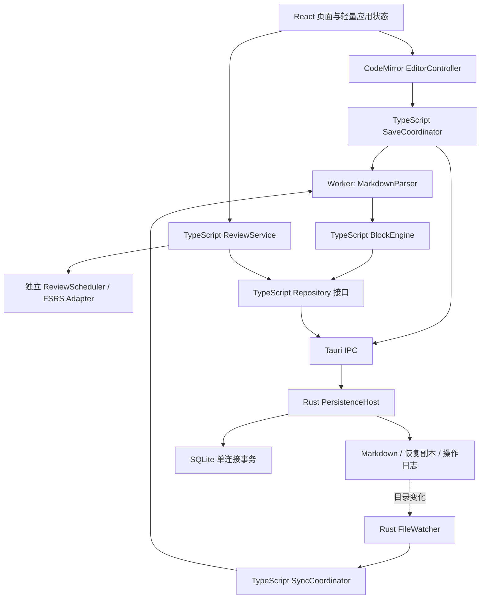
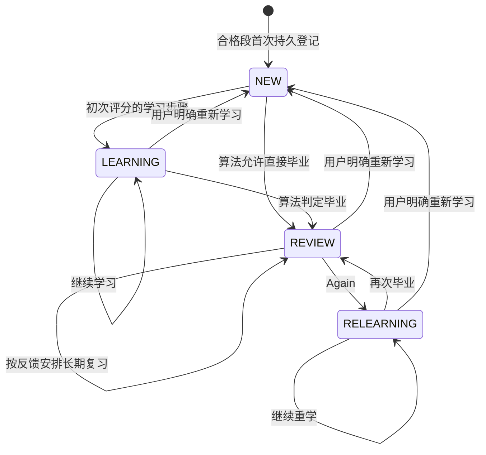
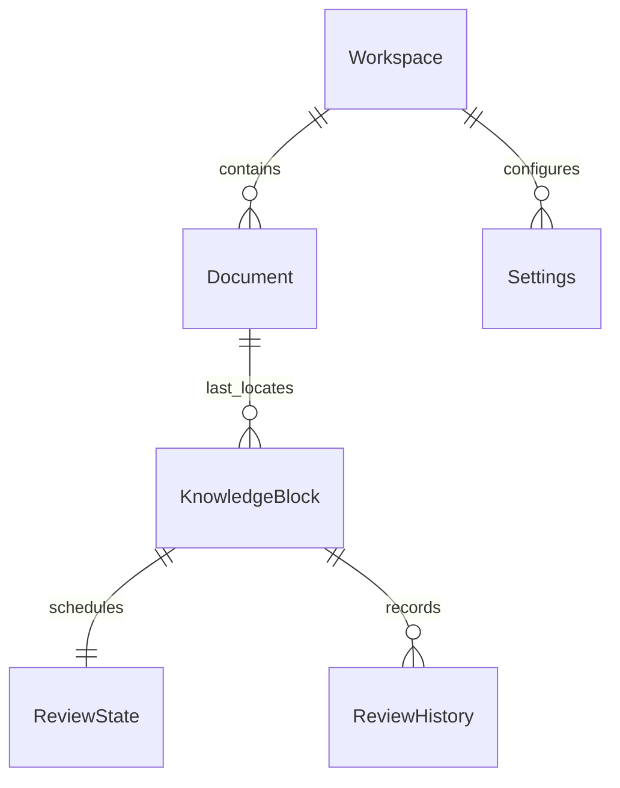
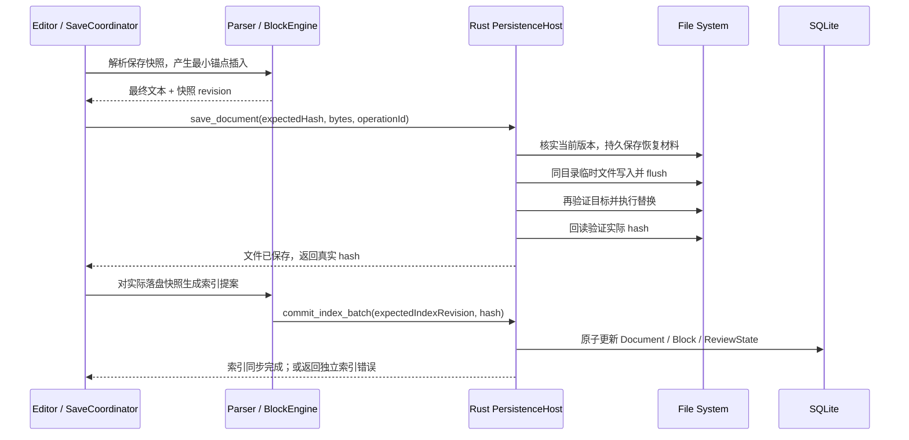
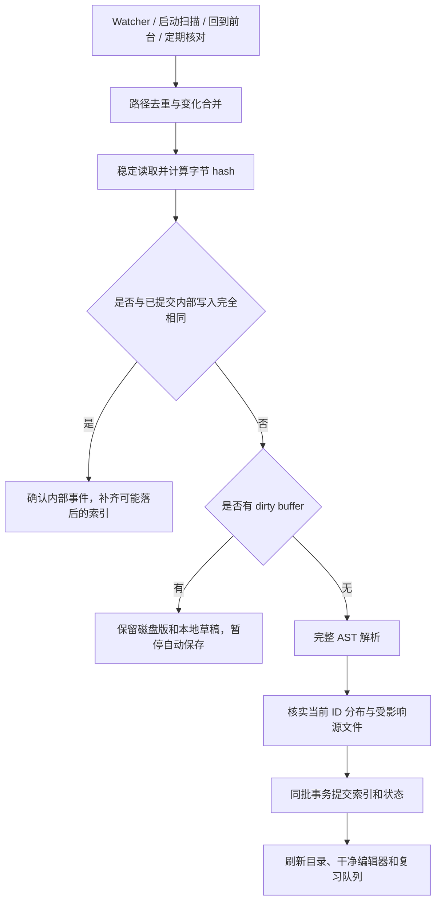
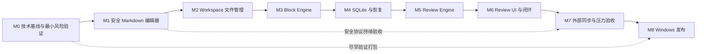

# RecallMD 产品与技术设计文档

> 文档版本：0.1 · 设计基线日期：2026-09-07 · 目标：Windows 本地桌面 MVP。
>
> 状态：**第一版设计提案，供产品负责人审阅**。正文的“已决定”表示本提案采用的实现基线，不表示用户已经批准。第 20 节单列编码前确认项；其余问题采用明确默认值，不阻塞设计。本文仅定义设计，SQL、接口和伪代码均为规格，不代表已实现功能。

## 1. Product Vision

RecallMD 首先是可靠的本地 Markdown 编辑器，然后才是围绕笔记的复习工具。用户写正常的知识笔记，保存后系统识别 Knowledge Block，按到期时间安排主动回忆。用户不用维护题面、答案面、牌组或制卡模板。

产品闭环：写作 → 保存 Markdown → 确认 Block 身份与版本 → 自动纳入复习 → 先回忆后看原文 → 反馈 → 安排下次复习。

### 1.1 需求中的矛盾、模糊点与高风险

| 问题 | 风险 | 本版解决方式 |
| --- | --- | --- |
| 普通 Markdown 的纯净性与稳定 Block ID | 完全不写 ID 时，重复段落、改写、移动无法始终区分 | 采用隐藏 HTML 注释；承认它会出现在源码和 Git diff 中 |
| 自动进入复习与已有知识库数千段内容 | 初次打开就修改全部文件、产生巨量任务 | 浏览扫描不改正文；在 RecallMD 成功保存的有效段自动纳入，旧文件可逐文件执行“纳入复习” |
| 自然笔记与可回忆的最小知识单位 | 大段笔记可能不可独立回忆 | 按标题直属正文分段；提示过长；用户用普通标题调整，不强制拆成闪卡 |
| 标题层级与复习内容重复 | 父标题包含子节会反复复习相同文字 | Block 的答案范围互不重叠；父标题只拥有直属正文 |
| 文件为事实来源，但 SQLite 记录历史 | 文件和数据库无法使用一个原子事务提交 | 内容先安全落盘，索引随后事务更新；可重放操作日志，不回滚文件去迎合旧数据库 |
| 尽量少写 Rust 与可靠本地 I/O | 仅调用简单的前端写文件接口不足以处理替换失败与事务 | Rust 承担小型持久化边界，TypeScript 承担解析、匹配、调度 |
| 修改笔记与历史记忆状态有效性 | 字符改动少也可能完全改变含义，例如“可以”改成“不可以” | 只自动识别保守的格式变化；实质正文变化由用户决定沿用或重学 |
| “绝不丢内容”与断电、磁盘故障、其他进程覆盖 | 任何普通桌面软件都无法作无条件硬件级保证 | 定义可验证的不变量、恢复副本和故障注入验收；不声称跨程序写入绝对串行 |
| Local-first 与 exe 安装 | WebView2 缺失时默认安装流程可能联网 | 主交付采用带 WebView2 离线安装器的 NSIS setup.exe |

### 1.2 不得违反的不变量

1. `.md` 是**当前正文**的唯一事实来源；SQLite 不得把旧正文自动写回文件。
2. 未成功保存的编辑内容，不能被标成“已保存”；索引失败与保存失败分别显示。
3. 一个 Workspace 内，一个有效 `block_id` 最多绑定一个当前 Block。冲突时冻结身份，不能采用“扫描到谁就归谁”。
4. 复习历史只追加。删除、重置、暂停、索引重建不得抹掉已有历史。
5. 文件不可访问不等于文件被删除；解析失败不等于所有 Block 被删除。
6. Rating 必须对应用户刚刚揭示的那个已落盘内容版本；过期提交必须被拒绝。
7. RecallMD 的任意覆写操作，必须先保存可恢复的旧版本，并验证预期磁盘版本。
8. 功能优先级：内容安全 > 编辑可靠性 > 身份正确性 > 调度正确性 > 展示效果。

## 2. Goals

| 目标 | 第一版完成定义 |
| --- | --- |
| 长期可用的编辑器 | 中文输入、语法高亮、搜索替换、撤销重做、可靠保存和冲突处理可用 |
| 本地知识库 | 选择文件夹，管理文件和目录，离线使用，无账号与服务端 |
| 自动复习单位 | 根据普通 Markdown 标题创建 Block；正常写作无须制作题目 |
| 稳定身份 | 有效 ID 随内容移动；明确处理复制、ID 丢失、拆分、合并 |
| 可解释复习 | 显示到期依据、四级反馈、修改提示、暂停与排除 |
| 可恢复元数据 | 完整备份可恢复历史；只有 Markdown 时可重建身份和索引 |
| 可交付桌面软件 | Windows 10/11 x64，NSIS `.exe` 安装包，干净机器离线验收 |

已决定：一进程、一主窗口、一次激活一个 Workspace；可以记录最近打开的多个 Workspace，切换前必须处理未保存缓冲区。

## 3. Non-Goals

本版不做账号、云服务、Spring Boot、MySQL、Redis、云同步、多人协作、移动端、macOS/Linux 发布。不做 Anki 式制卡模板、挖空语法、双向卡片、AI 自动出题、语义搜索、知识图谱、插件市场或完整 Typora 式 WYSIWYG。

不做自研 Markdown 解析器、自研记忆公式、自动合并 Git 冲突、任意位置手动划块、跨 Workspace 转移复习历史、批量历史回放优化、FSRS 个体参数训练。MVP 不提供全库正文全文搜索，仅文件名过滤和当前文件搜索替换。

支持范围限于本机固定磁盘的 NTFS 文件夹；网络盘、云盘同步目录、可移动介质、多进程共同写同一个 `.recallmd` 数据库不属于第一版支持环境。网络盘不能直接承载本方案的 WAL 数据库，这与 SQLite 的共享内存要求有关。[SQLite WAL](https://sqlite.org/wal.html)

## 4. Core Concepts

| 概念 | 定义 | 身份与生命周期 |
| --- | --- | --- |
| `Workspace` | 用户选定的根文件夹和其 `.recallmd` 元数据目录 | `workspace_id`，根路径变化不等于新库 |
| `Document` | 根目录内一个普通 `.md` 文件 | `document_id` 存数据库；路径是位置，不是身份 |
| `BlockCandidate` | 解析得到但尚无有效持久 ID 的可复习段 | 临时对象，不进入到期队列，无复习历史 |
| `KnowledgeBlock` | 有有效注释 ID 的标题直属正文，或文件前言 | `block_id` 来自文件；位置、标题、文本都可变化 |
| `ContentVersion` | 同一 Block 的已索引答案内容修订号 | 从 1 递增；不使用时间戳充当版本 |
| `ReviewState` | 当前调度快照、参与策略、变更待确认状态 | 每个已登记 Block 一条；可从历史和配置恢复 |
| `ReviewHistory` | 评分或用户改变复习状态的追加事件 | 记录前后快照与内容版本，永不级联删除 |
| `DocumentRevision` | 某次读取/保存确认过的文件字节版本 | SHA-256；文件的 mtime 只用于发现线索 |
| `IndexRevision` | 当前 Document 元数据提交的序号 | 防止旧 Worker 结果和旧 UI 覆盖新状态 |

### 4.1 时间与单位

持久化时间统一为 UTC Unix 毫秒整数，字段后缀 `_at`；间隔明确使用 `_ms` 或 `_days`。UI 按用户时区显示，默认 `Asia/Shanghai` 或首次启动检测到的系统 IANA 时区并保存。日统计使用该时区的本地午夜边界，不能用 UTC 日期截断代替。

`created_at` 是 RecallMD 首次持久登记时间；`content_modified_at` 是首次观察到当前实质正文修订的时间。文件系统 birthtime/mtime 不代表知识创建时间。数据库丢失后无法从 UUID 和文件日期还原真实创建时间，恢复记录应标注来源。

所有新 ID 使用随机 UUID v4，小写标准连字符格式；不包含时间、路径或内容哈希。ID 唯一域为一个 Workspace；同一 `.md` 在两个独立 Workspace 中分别管理，不共享历史。

## 5. User Experience

### 5.1 首次打开 Workspace

1. 用户选择文件夹，检查路径、读写权限、现存 `.recallmd/workspace.json` 和数据库版本。
2. 首次启用时说明：“保存可复习段时会插入不可见于正常预览的 HTML ID 注释；学习记录保存在 `.recallmd`。”用户可先只浏览。
3. 建立目录索引，扫描不改任何 `.md`。尚未带 ID 的旧内容显示“未纳入复习”。
4. 在 RecallMD 编辑并成功保存文件时，为该文件的合格 Candidate 添加 ID，默认自动启用复习。用户也可在一个未修改文件上执行“纳入复习”，预览新增注释后安全保存。
5. 已有有效 ID 的文件直接恢复/登记 Block；全新登记的 Block 首次到期设为登记后 24 小时。

“自动进入”具体指**保存产生的有效 Block**；不是允许后台未经交互批量改写旧库。第一版不提供全库注释批量写入工具。读取时发现外部新建的无 ID 段，也只提示纳入；不会因为 Watcher 事件自行改文件。

### 5.2 一次写作与一次复习

编辑器保持普通 Markdown 源码体验；保存后状态栏显示“已保存 · 3 个复习块”。侧边栏显示当前已经到期的数量。首次到期前也可以在正文阅读，但本版没有提前评分按钮。

复习先展示文件路径、祖先标题及当前标题，例如 `Redis / 持久化 / RDB`，正文默认遮蔽。无标题前言显示“文件名 / 前言”。用户回忆后选择“显示原文”，看到此 Block 的完整直属正文，再选择 Rating。可选 `recall_prompt` 是一句回忆提示，保存在 SQLite；它不是必填题面，也没有独立答案字段。

“显示上下文”在揭示前仅打开目录、祖先标题和定位信息；阅读相邻正文须明确点击“展开上下文正文”，视作答案已揭示并记录 `context_used=true`。这避免上下文在用户尚未回忆时自动泄露答案。

### 5.3 用户可控制的复习粒度

用户通过添加、调整普通 Markdown 标题拆分范围；可对单个 Block 设置提示、暂停、恢复、永久排除、重新学习。过长 Block 只作建议，不自动拆分，不阻止编辑或评分。没有可阅读答案的空段不进入复习。

## 6. System Architecture

已决定：`TypeScript + React + CodeMirror 6 + Tauri 2 + SQLite`。构建使用 Vite；生产不运行 Node 服务。包版本在 M0 验证后精确锁定，提交 JS 与 Cargo lockfile，不在运行时下载依赖。



### 6.1 职责与边界

| 层 / 组件 | 负责 | 不负责 |
| --- | --- | --- |
| `React` | 布局、路由、状态提示、对话框、列表 | 直接拼 SQL、处理每次文本输入 |
| `EditorController` | 持有 CM 实例、选区、撤销栈、dirty/base 状态、组合输入 | 复习算法、全库解析 |
| `MarkdownParser` | 完整文本生成带 offset 的 mdast；提取段、解析有效注释 | 写文件和决定历史归属 |
| `BlockEngine` | 身份校验、位置更新、正文指纹、冲突诊断 | I/O、猜测语义相似度 |
| `ReviewService` | 队列、参与策略、内容版本校验、调用 Scheduler | 直接操作编辑器源码 |
| `ReviewScheduler` | 输入不可变快照，输出新快照和调度结果 | React、Tauri、SQLite、读取系统时钟 |
| `Repository` | 有类型的查询和提交 DTO，统一序列化/校验 | 泛型 ORM、开放任意 SQL 给 UI |
| `Rust PersistenceHost` | 路径校验、文件读写/替换、备份、锁、数据库事务、扫描 I/O | Markdown 划块、评分公式、模糊匹配 |
| `Rust FileWatcher` | 监听变化和溢出、发出待核实的路径提示 | 把监听事件直接当作最终事实 |
| `SQLite` | 索引、身份登记、当前复习状态、追加历史和设置 | 当前 Markdown 正文 |

Tauri 的 WebView 与 Rust 核心通过 IPC 交互，Windows 使用 WebView2；它不意味着 React 可以任意访问文件系统。[Tauri 架构](https://v2.tauri.app/concept/architecture/)、[Process Model](https://v2.tauri.app/concept/process-model/)

### 6.2 持久化实现选择

采用 Rust `rusqlite`（bundled SQLite，带 backup 能力）和一个专用数据库工作线程；连接只在该线程使用。读写请求排队，长备份分页运行，SQL 全部参数化。Rust 提供少量有类型命令，例如 `read_document`、`save_document`、`commit_index_batch`、`submit_review`、`backup_workspace`，SQL 和事务实现集中放在存储模块。[rusqlite 文档](https://docs.rs/rusqlite/latest/rusqlite/)

没有选择直接从多个 JS `execute()` 调用拼出事务。官方 SQL 插件提供 JS 查询/执行接口及迁移，但跨命令的业务原子性仍需明确实现；本方案直接在一个 Rust 命令内开启和提交同连接事务，更容易验收。增加的是持久化代码，不是另一套 Rust 业务模型。[Tauri SQL 插件](https://v2.tauri.app/plugin/sql/)

TS 的计算结果只是提案，Rust 命令必须再次校验 `expected_revision`、当前 Block 可用性、已核实文件哈希、状态 DTO 和请求 ID。复习算法不在 Rust 重算。

### 6.3 状态管理与安全边界

React Context + reducer 管理活动 Workspace、当前文件、界面状态即可；编辑器全文驻留 CM，不能每个按键同步到 React 全局 store。原生事件由一个协调器订阅并清理，禁止每个组件建立 Watcher。

Tauri capabilities 按所需命令最小开放；Rust 只接受已激活 Workspace 的相对路径，规范化后核验实际目标及父目录仍在根内。禁止 `..`、路径前缀绕过、NTFS alternate data stream 路径、符号链接/junction 逃逸；MVP 不遍历 reparse point。创建时对不存在的目标校验真实父目录；Windows 保留名、结尾点/空格、大小写冲突均先拒绝。[Tauri Capabilities](https://v2.tauri.app/security/capabilities/)

预览与复习渲染采用受控 Markdown 渲染组件，原始 HTML 默认零执行；禁用 script、事件属性、iframe、`javascript:` 链接。M9 起的两个例外：其一，受限 HTML 白名单——行内 `sub`/`sup`/`kbd`/`br` 与块级 `details`/`summary` 反解析为受控 React 元素（不放开任意标签/属性，仍无 innerHTML 路径）；其二，Mermaid 图表——`securityLevel:"strict"` 运行，产出 SVG 经 DOMPurify 白名单（svg/svgFilters profile）消毒后注入，是全仓库唯一 `dangerouslySetInnerHTML` 点位。外链点击交给系统浏览器，只允许 `https`/`http`；图片只加载工作区相对路径（asset 协议，Rust 侧按激活工作区运行时放行 scope，关闭时收回）与 `data:image` 内联数据，远程图片不自动加载（偏离下文"单次授权"构想，本版直接不加载，保持离线原则）。代码块高亮（lowlight/highlight.js 子集）与 `==高亮==`、脚注编号跳转、文内锚点均为渲染层实现，不改变 mdast 与引擎指纹。路径链接在应用内定位，不能让 Markdown 触发任意 Tauri 命令。

## 7. Markdown Storage Model

### 7.1 目录布局

```text
Knowledge/
  Java/JVM.md
  Redis/Redis.md
  assets/redis.png
  .recallmd/
    workspace.json            # workspace_id、format_version；不存绝对路径
    metadata.sqlite
    metadata.sqlite-wal       # SQLite 管理，不手动删除
    metadata.sqlite-shm
    workspace.lock            # OS 锁的载体；文件存在本身不等于被占用
    operations/<operation_id>.json
    recovery/<document_id>/<revision_id>.md
    backups/<backup_id>/
    trash/<operation_id>/     # 保留删除内容及原路径清单
```

最近 Workspace 路径放在 Tauri 的应用配置目录；Workspace 复习设置放本库 SQLite；全局主题（M9，浅色/深色/跟随系统）存 WebView localStorage——它是纯 UI 偏好，不参与备份迁移，且需要在未打开知识库的启动屏阶段生效（偏离"放 Tauri 应用配置目录"的原构想，行为等价）。Windows 的真实配置路径由 Tauri 获取，不硬编码用户名。`.recallmd` 是普通目录，点前缀在 Windows 不保证隐藏；目录树始终将它隐藏并排除解析。

本库整体可移动：关闭应用后搬走整个文件夹，重新选择目录，根据 `workspace.json` 复用身份并更新本机最近路径。同一份库被完整复制后两边各自继续写是分叉，本版不合并；开启第二份时提示路径不同并避免同时激活。manifest 丢失但 SQLite 尚在时可从 Workspace 行恢复；两者都丢失则创建新 Workspace ID。

### 7.2 文件格式约定

| 项目 | 已决定 |
| --- | --- |
| 文件扩展名 | 大小写不敏感的 `.md`；其他 Markdown 扩展名留待后续 |
| 编码 | UTF-8；保留现有 UTF-8 BOM；非法 UTF-8 只读并提示另存转换，不猜 GBK 后覆写 |
| 换行 | 内部统一 LF；保存恢复原文件一致换行风格；新文件 LF；混合换行需明确提示规范化后才写入 |
| 文件结尾 | 不默认补换行、不删除尾空格；禁止全文件自动格式化 |
| 方言 | CommonMark + GFM 表格、任务列表、删除线、自动链接；识别 YAML frontmatter 但不当答案 |
| 引用定义 | 文件级 link/image reference definition 作为解析上下文，不作为独立答案；复习渲染携带所需定义 |
| 图片 | 文本保存相对路径；用户选取/粘贴图片时复制到 `assets/` 唯一文件名，再插入链接；不自动清理未引用图片；M9 起预览/复习显示工作区相对路径图片（asset 协议）与 `data:image`，远程图片不自动加载 |
| 元数据注释 | 只写稳定 Block ID；评分、时间、算法状态不写回正文 |

v0.1 规范不包含 LaTeX、执行代码等扩展。v0.2（M9）按"预览/复习同渲染"原则补齐阅读层：Mermaid 运行时渲染（懒加载 + DOMPurify 消毒）、预览/复习代码高亮（lowlight 子集，受控元素非 innerHTML）、`==高亮==` 行内方言（渲染层拆分，不改引擎指纹）、GFM 脚注编号跳转与文内锚点（GitHub 风格 slug）、受限 HTML 白名单（sub/sup/kbd/br/details/summary）。LaTeX 公式与代码执行仍不在范围内。本文中的 Mermaid 示例图不构成对其他图表语法的承诺。

### 7.3 CodeMirror 6 决策

采用 CodeMirror 6。它的事务模型、扩展机制、撤销历史、Markdown 支持和视口渲染符合源码编辑器需求。官方文档说明大文档只渲染视口附近内容，但这不自动解决全量解析、预览和 React 重渲染开销。[CodeMirror System Guide](https://codemirror.net/docs/guide/)、[Reference](https://codemirror.net/docs/ref/)

MVP 支持语法高亮、标题/列表/代码块/引用/表格源码、链接图片插入、折行、行号、当前文档搜索替换、选区缩进、括号匹配、撤销重做。提供可切换的只读预览，默认关闭，使用同一 Markdown 方言；复习页复用其渲染模块。

快捷键：`Ctrl+S` 保存，`Ctrl+F` 查找，`Ctrl+H` 替换，`Ctrl+Z` 撤销，`Ctrl+Y` / `Ctrl+Shift+Z` 重做，`Ctrl+B` / `Ctrl+I` 插入强调，`Ctrl+K` 插入链接，`Ctrl+P` 按文件名打开。快捷键须在中文 IME、WebView2 中验收，不拦截组合输入过程。

ID 注释第一版在源码中正常可见并以弱色高亮，预览不显示；不做默认折叠或不可见受保护区，以免破坏选区与剪切语义。维护光标与 CM ChangeSet 映射，注释插入作为独立系统事务，不计入用户文本撤销历史；Undo 恢复内容后须重解析，不能盲用旧范围删除新注释。M3 必须覆盖这些交互。

## 8. Knowledge Block Model

### 8.1 已决定：标题 + 直属正文

使用 `remark-parse + remark-gfm + remark-frontmatter` 构建完整 mdast；依据根级节点和位置做切片。CM 的 Lezer 树只服务交互式高亮，不作为持久 Block 索引的唯一来源，避免未完成的后台语法树造成漏块。原始文本只按 offset 插入 ID，不经 AST stringify 重写。[remark](https://github.com/remarkjs/remark/blob/main/readme.md)

算法规则：

1. 只把 Markdown AST 根节点直接包含的 ATX 或 Setext Heading 当边界。代码块、列表、引用、HTML block 内类似 `#` 的文本不是边界。
2. 一个标题的直属正文从标题结束后开始，到**下一个根级 Heading（任意级别）**开始前结束；最后一个到文件末尾。
3. 祖先标题由标题深度栈计算，遇到深度小于等于栈顶的新标题先出栈。允许跳级，不虚构中间标题。
4. 文件首个标题前的内容，扣除 frontmatter 和元数据后，合格则生成一个 `PREAMBLE`；无标题文件最多一个 Block。
5. 合格正文至少包含 paragraph、list、blockquote、table、code 或 image 中的一项有效内容；仅空白、注释、分隔线、reference definition、纯原始 HTML 不合格。只有标题不生成 Block。代码正文可单独成块，图片段可成块。
6. 子标题自己的 Block 不属于父 Block 的答案；父标题没有直属正文时只是导航容器。
7. 一段包含多个普通段落、列表、代码和表格时，它们属于同一 Block。分隔线不拆块，标签不改变边界。

这些边界由 AST 判定，不能使用逐行正则把所有 `#` 识别成标题。[CommonMark 规范](https://spec.commonmark.org/0.31.2/)

例如：

```markdown
# Redis
<!-- recall:block:1d078218-f7f6-4b83-89ae-d4155b0a5a10 -->

Redis 是一个基于内存的数据结构服务器。

## RDB
<!-- recall:block:b8c0f3bd-9c2e-4c74-8e5a-3ab91d611901 -->

RDB 是 Redis 的一种持久化机制。
它通过 fork 创建子进程生成快照。

## AOF
<!-- recall:block:8912fcb7-6430-4c7a-b5f8-e629a26a3e01 -->

AOF 记录写命令。
```

结果是 3 个 Block：`Redis` 的简介、`Redis / RDB`、`Redis / AOF`。不是一个父块包含整篇文件再加两个子块。

### 8.2 范围、版本与指纹

| 属性 | 定义与用途 |
| --- | --- |
| `start_offset`, `end_offset` | 内部 LF 文本的 UTF-16 半开区间 `[start,end)`，包含自身标题/注释/直属正文；前言不含 frontmatter |
| `body_start_offset` | 答案起点；渲染仍按 AST 排除 ID 注释和 reference definition |
| `ordinal` | 文件中当前顺序，0 起；只用于定位，不作为身份 |
| `heading_path_json` | 当前祖先标题与自身标题的文本数组；无标题前言用空数组 |
| `source_hash` | 此 Block 切片去掉自己的合法 ID 注释、统一 EOL 后的 SHA-256；包含标题，不用于自动认领 |
| `body_hash` | 答案 AST 的确定性序列化 SHA-256；去除 position，排除 HTML 注释与定义本身；保留 code 空白、文本、强调类型、列表顺序、链接目标等 |
| `content_version` | `body_hash` 改变才加 1；位置、标题路径、ID 注释变化不加 |
| `index_revision` | Document 任意有效重索引都增加；用于让题面变化和位置变化使旧 UI 失效 |

答案 AST 中引用式链接先解析到文件级定义；定义中的目标变化必须改变使用它的 Block 的 `body_hash`。图片文件字节变化本版仅触发资源刷新，不自动重置记忆；答案哈希包含图片路径与 alt，提示用户更换图意后手动重学。

确定性序列化使用显式字段白名单和固定对象键顺序，数组维持原顺序；原始 HTML 注释排除，代码文字逐字符保留。规则标记为 `fingerprint-v1`，与解析器版本共同写入 `Document.parser_version`。升级解析/指纹规则属于索引迁移：先备份、预览受影响段；不能仅因为新解析器生成不同 JSON 就批量把知识判为被用户修改。

“格式变化”的判定保守：相同 AST 正文表示不影响调度，例如空行变化。无法证明等价就视为正文变化；不使用词向量或编辑距离判断知识含义。祖先/自身标题改变刷新提示和会话，不推断正文已忘记。

offset 只对 `Document.content_hash + index_revision` 有效；禁止作为跨文件版本的持久锚点。UTF-8 字节偏移与 JS UTF-16 索引不可混用。原生层仅在文件级存字节哈希，TS Parser 负责文本偏移。

### 8.3 边界样例与人工调整

| 输入/操作 | 结果 |
| --- | --- |
| `# A` 紧接 `## B`，A 无正文 | A 是容器，只有 B 可成块 |
| 无标题的三个段落 | 一个前言 Block |
| 围栏代码中的 `## AOF` | 留在代码内，不创建 Block |
| `> ## 注意` 或列表里的 heading | 属于所在直属正文，不另外划块 |
| 两个相同标题、相同正文 | 有各自独立 ID；不得去重成一个对象 |
| 新增小标题拆开原正文 | 携带旧锚点的一段继承身份，新段分配新 ID |
| 单块超过 8,000 个可见字符或 200 行 | 提示“建议拆分以便回忆”，不强制；阈值可在后续验证调整 |
| Git 冲突标记 `<<<<<<<` 等出现在非代码区域 | 文档暂停索引提交与复习，保留旧索引直到用户解决 |

## 9. Block Identity Strategy

### 9.1 两种方案比较

| 维度 | A：Markdown 隐藏 ID 注释 | B：纯 SQLite + hash / AST / fuzzy matching |
| --- | --- | --- |
| 稳定性 | ID 保留时，改写和移动均直接识别 | 不变唯一内容容易；移动并改写、重复内容难以证明身份 |
| Markdown 纯净程度 | 加一行标准 HTML 注释，源码有侵入 | 零内容侵入 |
| 实现复杂度 | 注释格式、重复 ID、丢失处理需要规则；总体可控 | 需候选召回、相似度、阈值、全库匹配、纠错 UI |
| 外部编辑器 | 普通工具能读；若工具删除注释则丢锚点 | 工具可自由改文本，但身份判断更不可靠 |
| Git diff | 新 Block 有一次 ID 变更，之后正文正常 diff | 正文无额外 diff；数据库不能友好文本合并 |
| 文件移动 | 扫描新位置可按 ID 恢复 Block | 未改内容可用唯一哈希；同时改写时易失联 |
| 内容修改 | ID 不变即原 Block 修订 | hash 会变化；只能推断，不能保证 |
| Block 移动 | 连同注释移动即可，包括跨文件 | 依赖全局候选匹配，重复段落有歧义 |
| 错误匹配风险 | 主要来自复制 ID、误放注释，可以显式检出 | 容易把不同知识的相似文字错误继承历史 |
| 数据库丢失 | 文件仍带 Block ID；历史须备份恢复 | 原身份和历史都无法仅凭内容可靠还原 |

**已决定：第一版采用 A，失败时显式解决身份问题。** 不实施 B 的自动模糊匹配后门。保存注释的少量成本，比不可解释地把旧学习记录绑定到新知识更可控。未来若支持纯净模式，应作为另一种明确的 Workspace 身份策略单独设计，不能悄悄更换。

### 9.2 注释协议 v1

格式必须为独立一行的 `<!-- recall:block:<uuid-v4> -->`，UUID 按第 4 节格式校验。只在 AST 确认为 HTML comment 且满足下列位置时生效：标题结束后、第一项正文前，之间只允许空白；前言则位于 frontmatter 后第一项正文前。标题跨度包括 Setext 下划线，不能插到标题与下划线之间。

代码中的示例注释不生效。正文中间、尾部或同一候选内出现额外的协议注释，列为位置异常/合并冲突；不自动搬运或删除。无正文标题下原有锚点保留在文件中，但不产生当前可复习 Block；原身份可在后续恢复正文时重新激活。

插入只发生于正常保存或明确的“纳入复习/解决 ID 问题”操作。新 ID 在生成后必须随正文落盘再进入 SQLite，保存失败不登记。没有内容改动的 `Ctrl+S` 不触发旧库纳入操作，避免仅想保存却批量改变文件。

### 9.3 匹配顺序与冲突策略

每轮解析先产生候选集合和有效锚点位置，再基于受影响文件及 Workspace 已核验的活动 ID 注册表判断。疑似跨文件移动或重复 ID 时，必须核实旧持有文件仍然存在并重新读旧位置，必要时全库重扫；不能因旧索引尚未处理删除而判定复制。

```text
reconcile(stableSnapshots, registeredBlocks):
  reject stale snapshots, parse errors and unresolved Git conflicts
  build id -> all current occurrences, including unresolved diagnostics
  for each id:
    if current occurrences == 1 and old location has been verified absent/moved:
      update same Block's location and content metadata
      restore tombstone when applicable; keep history and participation policy
    else if current occurrences == 1 and location is unchanged:
      update same Block
    else if current occurrences > 1:
      mark ID_CONFLICT; retain last known mapping; disable its review
      do not rewrite either document automatically
  keep unanchored candidates outside review
  mark disappeared identities MISSING pending settled reconciliation
  confirm DELETED only after successful stable reconciliation
  commit all affected metadata in one SQLite transaction
```

`ID_CONFLICT` 可以有多个当前出现位置，但 `KnowledgeBlock` 只能有一条身份记录；新出现且从未登记的重复 ID 先只存在文档诊断中，不创建任意“赢家”。诊断列表保存在 `Document.diagnostics_json`，仅保存位置、ID、错误码。排队、全库扫描和已知冲突位置都参与去重判断。

### 9.4 十类操作的明确结果

| 操作 | ID 与历史 | 复习状态 / 用户处理 |
| --- | --- | --- |
| 1. 修改正文 | 有效 ID 原样保留；追加内容版本 | 格式变化沿用；实质变化按第 10.3 节处理 |
| 2. 删除 Block | 软删除登记，不删除历史；文件中删除由用户编辑产生 | 立刻离开可评分队列，稳定确认后 `DELETED` |
| 3. 剪切但尚未粘贴 | 原身份暂为 `MISSING`，随后可成 tombstone | 不让剪贴板持有权成为事实；不自动清空历史 |
| 4. 同文件移动 | 唯一 ID 随片段移动，更新 offset、ordinal、标题路径 | 正文不变则调度不变 |
| 5. 跨文件移动 | 同库内连同注释移动，核实源已消失后复用同一 ID | 移动过程中可暂不可复习；最终不复制 ReviewState |
| 6. 拆分 | 保留旧注释的片段继承旧 ID，其余新 ID | 旧片段正文变化待确认；新片段 NEW；不复制学习成功次数 |
| 7. 合并 | 删除边界后多枚 ID 落入同一候选，进入身份冲突 | 用户指定保留哪个 ID；其他 ID 软删除；不平均 S/D，不合并历史 |
| 8. 修改标题 | 有效注释仍属于该段则 ID 不变 | 更新题面；正文不变不重置；若改变边界按拆分/合并规则 |
| 9. 大规模重构 | 唯一锚点逐个识别；缺失/重复/错误位置显式列出 | 未能确认身份的段冻结；不按最相似批量认领 |
| 10. 外部编辑器修改 | 注释保留则同样处理；删注释无法保证自动恢复 | 不主动改外部文件；通过纳入或身份恢复操作修复 |

补充场景：

- **复制**：应用内明确的“复制文件/Block”命令若后续加入，必须为副本生成新 ID。MVP 普通复制粘贴仍是文本操作；重复注释被检出后，用户选择“此处是副本，生成新 ID”。不把两份内容当同一 Block。
- **丢失 ID**：旧 ID 标为缺失；新段为 Candidate。用户可从旧 Block 列表显式选中恢复 ID，系统要求该 ID 不在其他当前段出现，并按安全保存写回。默认不靠正文相同自动恢复。
- **复现 tombstone**：唯一旧 ID 重新出现即可恢复原历史；保留暂停/排除策略。正文与最后版本不同时触发内容变更；原计划已过期则立即到期，不把缺失时间当冻结记忆。
- **跨 Workspace**：复制文件可保留注释字符串，但目标库创建自己的新登记和 NEW 状态，不读取其他库历史。真正的历史迁移不在 MVP。
- **错误注释修复**：只修改用户明确选定的锚点行；合并时删除的失效注释属于本次明确操作，其他 Markdown 保持原样，并提供保存前差异。

## 10. Review Model

### 10.1 生命周期分成三个独立维度

不能把 `NEW → LEARNING → REVIEW → SUSPENDED → DELETED` 实现成单向枚举。暂停能恢复，删除可能撤回，已成熟知识忘记后会再学习。

| 维度 | 值 | 含义 |
| --- | --- | --- |
| `KnowledgeBlock.status` | `ACTIVE / MISSING / DELETED / ID_CONFLICT` | 当前内容身份是否可定位 |
| `ReviewState.participation` | `ENABLED / PAUSED / EXCLUDED` | 用户是否允许进入复习；排除没有自动恢复 |
| `ReviewState.phase` | `NEW / LEARNING / REVIEW / RELEARNING` | Scheduler 的记忆阶段 |



图中转换由被锁定的算法适配器返回值决定，不在 UI 按按钮硬编码。任何记忆阶段都可以暂停、排除或遇到内容缺失；这些维度不覆盖原 phase。

### 10.2 到期、队列与暂停

- 首次登记：`phase=NEW`，使用空算法状态，`scheduled_due_at=created_at+24h`；这 24 小时是产品首次提醒策略，不是 FSRS 推导值。初始化时将原生 Card 的 due 同样设为首次 due，不设置 last_review、不伪造评分；重置则用操作时间作为空状态 due，保证原生 due 与 scheduled_due_at 始终一致。
- `next_review_at = min(scheduled_due_at, change_due_at)`，其中 `change_due_at=NULL` 时取 `scheduled_due_at`。数据库使用生成列实现，不维护第三份可漂移的日期。
- 可评分条件：Workspace 可用且完成必要核验、Document PRESENT/READY、Block ACTIVE、participation ENABLED、`next_review_at <= now`、无未保存冲突、题面已揭示且令牌有效。
- “今日待复习”在 MVP 指**现在已到期**，不包含今天稍后才到期的学习步骤；页面可另显示“稍后到期”。数量随时间和状态刷新。
- 排序：已到期 LEARNING/RELEARNING 优先，其次 REVIEW，最后 NEW；组内按 `next_review_at, block_id`。每次取最多 50 条，不把全库一次装进会话。
- 新内容每天最多首次评分 20 个（可在设置中改为 0–100）；只限制此前从未评分的 Block。重置过的 Block 不借新卡配额逃避复习。到期总量和“今日剩余新内容名额”分别显示，不隐藏积压。
- 暂停/排除不改变算法 due、S/D、last_review；恢复时按真实已流逝时间处理，过期则到期，不冻结记忆时间。排除会一直保持，只有用户明确重新启用才进入队列。
- 文件缺失、身份冲突暂时抑制队列，不改用户参与策略。App 关闭不触发后台提醒；本版仅应用内 badge 和打开 Review 时刷新，不做系统常驻通知服务。

### 10.3 修改后的策略

| 变化 | 自动动作 | 后续 |
| --- | --- | --- |
| ID、位置、文件路径或祖先/当前标题变化，正文相同 | 更新索引，令旧会话失效 | 保留算法状态，不提前复习 |
| 答案 AST 相同，例如只改空行 | 不增加 content_version | 保留状态 |
| 答案正文 AST 改变，尚未首次评分 | 增加 content_version，初次 due 不顺延 | 首次评分直接针对新正文，无须额外决策 |
| 已有评分的答案正文改变 | 增加 content_version，`needs_recheck=1`；`change_due_at` 取现值与本次观察时间+24h 的较早者 | 下次评分前用户选择“小改动，沿用进度”或“知识已重写，重新学习” |
| PAUSED / EXCLUDED 段发生正文变化 | 同样记录修订与 recheck | 保持不参与，不自动恢复 |

首次设置 change_due 后，持续编辑不能无限把它向后推。“沿用进度”清除 recheck/override，保存 `ACCEPT_CHANGE` 事件，然后用原算法状态对当前正文评分；“重新学习”记录 `RESET`，算法状态变为空状态、`generation+1`，due=操作时间，历史保留，再对新内容评分。对于被 override 提前带来的会话，沿用决策和评分应在同一原子提交内完成，不能先清除 override 再因原 due 尚未来到而拒绝评分。

本版不推断文字改动百分比等于记忆变化百分比。拼写修正也可能弹出一次温和确认，这是减少错误重置的可接受成本。可以以后研究语义分类，但不能在没有验证的情况下直接改变用户记忆状态。

### 10.4 Rating 与提交契约

| Rating | 存储值 | 面向用户的解释 |
| --- | --- | --- |
| `Again` | 1 | 没回忆起来或关键内容错误 |
| `Hard` | 2 | 回忆正确，但很费力 |
| `Good` | 3 | 正常回忆正确 |
| `Easy` | 4 | 很轻松地完整回忆 |

用户看原文后才解锁评分。对长 Block，按主要结论是否正确自评；仅“看懂”不算回忆成功。显示本次四个预测间隔，正式点击时使用新的 `now` 重新计算，预览不是持久承诺。

打开题目时捕获 `block_id + content_version + document_hash + index_revision + state_revision`；Rust 给出进程内 `review_token` 绑定快照。答题期间正文或题面变化、文件变脏、身份冲突、重置/暂停、切换 Workspace 都使 token 失效。保存后重新揭示当前内容，不能把对旧答案的 Rating 自动提交到新版本。

`request_id` 为评分动作一次生成的 UUID，提交超时重试必须复用。一个 Rust `submit_review` 事务完成版本 CAS、历史追加、ReviewState 更新；重复请求返回已保存结果，不重复推进调度。UI 在数据库成功后再移到下一题；异常留在当前题并显示重试。

## 11. Review Algorithm

### 11.1 算法比较与决定

| 方案 | 优点 | 成本与局限 | MVP 结论 |
| --- | --- | --- | --- |
| 固定间隔，如 1/3/7/14/30 天 | 容易解释、测试，无依赖 | 不能自然表示不同难度和遗忘反馈；四个按钮的分支仍要自定义 | 只用作测试替身，不作正式算法 |
| SM-2 | 规则少、资料公开、实现容易 | 原始评分为 0–5；四按钮、短期学习和重新学习需补充明确规则；不直接输出 S/D | 不采用，避免维护自定义变体 |
| FSRS + 成熟 TypeScript 库 | 原生适配四级反馈，已有学习/复习状态及 S/D | 需冻结库版本、参数、序列化方式，理解日志与状态 | **采用 `ts-fsrs`，使用库配置和调度函数** |

SM-2 原始方案使用前两次 1 天、6 天和后续 ease factor，并采用 0–5 自评。这里不把 Hard/Good/Easy 随意映射成自称“标准 SM-2”的新规则。[SM-2 原始说明](https://www.super-memory.com/english/ol/sm2.htm)

`ts-fsrs` 提供 `repeat` 用于四结果预览、`next` 用于选定评分，并有 New/Learning/Review/Relearning 状态。本项目调用它，不重写公式；选用算法不等于声称长知识块获得某个保证记忆率。[ts-fsrs 官方说明](https://github.com/open-spaced-repetition/ts-fsrs/blob/main/packages/fsrs/README.md)

### 11.2 第一版调度配置

以下是本产品默认值；实际包版本和完整展开参数在 M0 通过 WebView2 冒烟验证后锁定，写入发布记录和每个状态配置快照。不得使用未锁定的 `latest`，也不得升级依赖后静默替换旧状态参数。

| 配置 | 值 | 理由 |
| --- | --- | --- |
| `request_retention` | 0.90 | 初始折中；MVP 不开放个体参数训练 |
| `maximum_interval` | 3650 天 | 产品上限 10 年，避免极长提醒；不是医学或记忆效果承诺 |
| `enable_fuzz` | false | 调度可复现，简化第一次实现的预览与验收 |
| `enable_short_term` | true | 支持当日学习/重新学习 |
| `learning_steps` | `['1m', '10m']` | 明确短期学习配置，转换交由库决定 |
| `relearning_steps` | `['10m']` | 忘记后支持短期回看 |
| `w` 等模型参数 | 锁定发行版的完整默认参数副本 | 不自行训练或手调；保存实际数值而非字符串“default” |

短间隔显示分钟，长间隔显示天；以库返回的绝对 due 持久化，不统一改成“次日零点”。S 的单位为天，D 在 FSRS 中为难度参数；它们不是 UI 自创评分。新状态尚未估计时通用投影可为 NULL，算法内部零值仍完整保留。

### 11.3 独立接口（概念规格）

```typescript
type Rating = 'Again' | 'Hard' | 'Good' | 'Easy';
type SchedulerEnvelope = {
  algorithmId: string;          // v1: 'fsrs'
  algorithmVersion: string;     // 实际模型版本 + 库版本
  stateSchemaVersion: number;   // 本适配器序列化格式版本
  config: JsonObject;           // 完整展开且冻结的参数
  nativeState: JsonObject;      // 无损保存库的全部 Card 字段
};

interface ReviewScheduler {
  initialize(input: {
    nowMs: number;
    initialDueAtMs: number;     // 首次登记为 now+24h；重置为 now
    config: JsonObject;
  }): SchedulerEnvelope;
  schedule(input: {
    state: SchedulerEnvelope;
    history: readonly ReviewEvent[]; // 当前 generation；在线 FSRS 不必全量读取
    rating: Rating;
    nowMs: number;                   // 由调用方注入，禁止模块内 Date.now()
  }): {
    state: SchedulerEnvelope;
    phase: 'NEW' | 'LEARNING' | 'REVIEW' | 'RELEARNING';
    scheduledDueAt: number;          // 算法原始结果
    intervalMs: number;              // due - now，可小于一天
    stability: number | null;
    difficulty: number | null;
    reps: number;
    lapses: number;
    log: JsonObject;                 // 原生 ReviewLog 的无损 JSON
  };
}
```

`ReviewService` 根据产品首次 due、参与策略、正文变更覆写计算 `nextReviewAt`；Scheduler 只输出记忆安排。适配器须无损保存 `due`、`last_review`、`stability`、`difficulty`、`elapsed_days`、`scheduled_days`、`reps`、`lapses`、`state`、学习步骤计数及锁定版新增字段。Date 序列化为 UTC 毫秒，反序列化时显式还原，不能把字符串对象直接传给库。

`nativeState + config` 是算法状态的权威快照；表中 S/D/phase 等为可索引投影，必须同一事务由同一结果写入。校验不一致时停止评分并重建投影，不择其一继续运行。

### 11.4 替换与校验

替换算法只增加新的 adapter 和状态迁移，不改编辑器、Block ID 或历史事件表。旧事件保留原算法版本和 before/after/config。默认迁移策略是明确重置为新算法的新 generation；仅当有可验证转换/重放方案才保留记忆参数，不把不同算法的字段直接混用。

M5 验收需覆盖四种 Rating、学习和重学、逾期、分钟间隔、日界线、暂停恢复、序列化往返、同请求重试、重复评分、内容改变后拒绝旧 token。固定时钟对照锁定库输出，不编造“Good 必然 N 天”的手写期待值；关键长期输出保存少量 golden fixtures 用于升级检测。

系统时钟向后跳、`now < last_review_at` 或同进程 wall clock 与 monotonic clock 显著不符时暂停评分并提示检查时间，不使用负间隔。时区变化只影响显示和日配额/统计分界，不改已有 UTC due。

## 12. SQLite Schema

### 12.1 范围和通用约定

每个 Workspace 一个 `metadata.sqlite`，只有六张业务表：`Workspace`、`Document`、`KnowledgeBlock`、`ReviewState`、`ReviewHistory`、`Settings`。不单独建立用户、牌组、标签关系、全文索引或 Block 内容版本表。

**当前正文、旧正文、编辑器缓冲区均不存 SQLite。** 数据库允许保存标题、路径、回忆提示、AST 范围、哈希和算法 JSON；它们不组成可以反向覆盖 Markdown 的正文副本。恢复草稿、旧文件副本放在文件系统，性质是恢复材料，不是正常阅读的数据来源。

| 约定 | 规格 |
| --- | --- |
| 主键 | UUID `TEXT`；所有 FK 默认 `ON DELETE RESTRICT`，不级联删除学习历史 |
| 布尔 | `INTEGER`，CHECK 限定 0/1 |
| 时间 | UTC 毫秒 `INTEGER`；由同次操作的可信时钟值显式写入 |
| JSON | `TEXT` + `json_valid`；应用层继续做字段类型/版本校验 |
| 修改时间 | `updated_at` 是该行最近修改；没有隐式 UPDATE trigger |
| 历史时间 | 事件 `occurred_at` 是动作时间，`created_at` 是入库时间；事件不可修改，`updated_at=created_at` |
| 迁移 | 使用 `PRAGMA user_version`；Rust 有序执行 SQL 迁移，迁移前备份，失败回滚 |
| 连接 | `foreign_keys=ON`，`journal_mode=WAL`，`synchronous=FULL`，`busy_timeout=5000` |
| SQLite 版本 | bundled 引擎至少 3.51.3，M0 实际查询 `sqlite_version()` 并记录，不只看 Rust crate 版本 |

最低引擎版本考虑官方已记录的 WAL-reset 修复；它影响某些多连接写入/checkpoint 并发情形。即使本版限定单工作连接，也应交付已修复的引擎。[SQLite WAL 修复说明](https://sqlite.org/wal.html#the_wal_reset_bug)

### 12.2 表关系



`Document → KnowledgeBlock` 表示当前或最后已确认位置；软删除后关系仍在。未登记重复 ID 只存诊断，故不需要让 Block 随机绑定某个重复位置。每个已登记 Block 都建 ReviewState，包括暂停、排除和从文件恢复的 Block。

### 12.3 字段词典

以下同一行列出的字段采用相同类型；下一节 DDL 给出逐字段约束、主外键和完整索引。

| 表 | 字段 | 类型 / 含义 |
| --- | --- | --- |
| Workspace | `workspace_id`, `name` | TEXT；主键、显示名 |
| Workspace | `singleton`, `format_version` | INTEGER；固定单行 1、manifest 格式版本 |
| Workspace | `created_at`, `updated_at`, `last_opened_at` | INTEGER；创建、修改、打开时间 |
| Document | `document_id`, `workspace_id` | TEXT；主键、Workspace FK |
| Document | `relative_path`, `path_key` | TEXT；保留原始大小写的 `/` 相对路径、Windows 比较键 |
| Document | `file_identity` | 可空 TEXT；卷标识+文件 ID，仅辅助外部重命名检测，不是永久身份 |
| Document | `status`, `index_status`, `encoding`, `line_ending` | TEXT；存在状态、索引状态、编码、原始换行 |
| Document | `observed_hash`, `content_hash` | 可空 TEXT；最新观察字节哈希、最后成功索引字节哈希 |
| Document | `byte_size`, `disk_mtime_at` | 可空 INTEGER；最近观察到的大小和文件 mtime |
| Document | `index_revision`, `has_bom` | INTEGER；索引 CAS 版本、BOM 布尔 |
| Document | `parser_version` | 可空 TEXT；最后成功索引使用的解析器/划块/指纹规则版本；初次索引前 NULL |
| Document | `diagnostics_json` | TEXT；错误码、ID 和位置列表，不含正文 |
| Document | `created_at`, `updated_at`, `last_seen_at`, `missing_since`, `deleted_at` | INTEGER；末三项可空 |
| KnowledgeBlock | `block_id`, `document_id` | TEXT；注释 ID 主键、最后有效 Document FK |
| KnowledgeBlock | `kind`, `title`, `heading_level`, `heading_path_json` | TEXT / 可空 TEXT / INTEGER / TEXT；前言层级 0，标题 1–6 |
| KnowledgeBlock | `ordinal`, `start_offset`, `body_start_offset`, `end_offset` | INTEGER；LF/UTF-16 文本的顺序和半开范围 |
| KnowledgeBlock | `source_hash`, `body_hash`, `content_version` | TEXT / TEXT / INTEGER；第 8.2 节定义 |
| KnowledgeBlock | `status`, `status_reason`, `recall_prompt` | TEXT / 可空 TEXT / 可空 TEXT；身份可用性、诊断原因、用户提示 |
| KnowledgeBlock | `created_at`, `updated_at`, `content_modified_at`, `last_seen_at`, `missing_since`, `deleted_at` | INTEGER；最后两项可空 |
| ReviewState | `block_id` | TEXT；同时是 PK 和 KnowledgeBlock FK |
| ReviewState | `participation`, `phase`, `generation`, `state_revision` | TEXT / TEXT / INTEGER / INTEGER；参与、记忆阶段、重学代次、事务 CAS 序号 |
| ReviewState | `algorithm_id`, `algorithm_version`, `state_schema_version` | TEXT / TEXT / INTEGER；解释快照所必需的版本 |
| ReviewState | `config_json`, `state_json` | TEXT；完整参数、原生算法状态 |
| ReviewState | `scheduled_due_at`, `change_due_at`, `next_review_at` | INTEGER；算法 due、可空变更 due、生成列有效 due |
| ReviewState | `stability`, `difficulty`, `interval_ms` | 可空 REAL / 可空 REAL / INTEGER；算法投影、上次实际安排间隔 |
| ReviewState | `reps`, `lapses` | INTEGER；当前 generation 的算法计数，历史总数另查询 |
| ReviewState | `first_review_at`, `last_review_at` | 可空 INTEGER；首次评分终身保留、算法本代最后评分 |
| ReviewState | `needs_recheck`, `last_reviewed_content_version` | INTEGER / 可空 INTEGER；正文确认标记、上次评分版本 |
| ReviewState | `created_at`, `updated_at` | INTEGER；行时间 |
| ReviewHistory | `history_id`, `request_id`, `block_id` | TEXT；PK、幂等动作 ID、Block FK |
| ReviewHistory | `event_type`, `rating`, `generation` | TEXT / 可空 INTEGER / INTEGER；动作类型、1–4 Rating、动作完成后的代次 |
| ReviewHistory | `content_version`, `content_hash`, `document_hash` | INTEGER / TEXT / TEXT；当时正文版本、body_hash、已核实文件版本；不保存答案 |
| ReviewHistory | `before_revision`, `after_revision` | INTEGER；对应本次状态 CAS |
| ReviewHistory | `before_state_json`, `after_state_json`, `algorithm_log_json` | TEXT / TEXT / 可空 TEXT；含配置、参与策略与 override 的完整状态快照；原生算法日志 |
| ReviewHistory | `change_resolution`, `context_used`, `duration_ms` | 可空 TEXT / INTEGER / 可空 INTEGER；沿用/重学、是否看上下文、答题时长 |
| ReviewHistory | `occurred_at`, `created_at`, `updated_at` | INTEGER；动作与写入时间，历史不可修改 |
| Settings | `workspace_id`, `key`, `value_json` | TEXT；Workspace FK 与 key 组成 PK，值为 JSON |
| Settings | `created_at`, `updated_at` | INTEGER；行时间 |

`path_key` 按本版支持的 Windows 不区分大小写语义由原生层生成、比较；不能仅依赖 SQLite `NOCASE` 的 ASCII 行为。遇到启用区分大小写的目录且出现同键路径时报告不支持，不覆盖任一文件。规范化并不改用户实际文件名。文件替换可能改变 Windows file ID，故 `file_identity` 只作为短期线索。[Microsoft ReplaceFileW](https://learn.microsoft.com/en-us/windows/win32/api/winbase/nf-winbase-replacefilew)

### 12.4 第一版 DDL 规格

```sql
PRAGMA foreign_keys = ON;
PRAGMA journal_mode = WAL;
PRAGMA synchronous = FULL;
PRAGMA busy_timeout = 5000;

CREATE TABLE Workspace (
  workspace_id TEXT PRIMARY KEY NOT NULL,
  singleton INTEGER NOT NULL DEFAULT 1 UNIQUE CHECK (singleton = 1),
  name TEXT NOT NULL,
  format_version INTEGER NOT NULL CHECK (format_version >= 1),
  created_at INTEGER NOT NULL,
  updated_at INTEGER NOT NULL,
  last_opened_at INTEGER NOT NULL
);

CREATE TABLE Document (
  document_id TEXT PRIMARY KEY NOT NULL,
  workspace_id TEXT NOT NULL REFERENCES Workspace(workspace_id) ON DELETE RESTRICT,
  relative_path TEXT NOT NULL,
  path_key TEXT NOT NULL,
  file_identity TEXT,
  status TEXT NOT NULL CHECK (status IN ('PRESENT','MISSING','DELETED')),
  index_status TEXT NOT NULL CHECK (index_status IN ('PENDING','READY','ERROR','CONFLICT')),
  encoding TEXT NOT NULL DEFAULT 'UTF-8',
  line_ending TEXT NOT NULL CHECK (line_ending IN ('LF','CRLF','MIXED')),
  has_bom INTEGER NOT NULL DEFAULT 0 CHECK (has_bom IN (0,1)),
  observed_hash TEXT CHECK (observed_hash IS NULL OR length(observed_hash) = 64),
  content_hash TEXT CHECK (content_hash IS NULL OR length(content_hash) = 64),
  byte_size INTEGER CHECK (byte_size IS NULL OR byte_size >= 0),
  disk_mtime_at INTEGER,
  index_revision INTEGER NOT NULL DEFAULT 0 CHECK (index_revision >= 0),
  parser_version TEXT,
  diagnostics_json TEXT NOT NULL DEFAULT '[]' CHECK (json_valid(diagnostics_json)),
  created_at INTEGER NOT NULL,
  updated_at INTEGER NOT NULL,
  last_seen_at INTEGER,
  missing_since INTEGER,
  deleted_at INTEGER
);
CREATE UNIQUE INDEX document_live_path
  ON Document(workspace_id, path_key) WHERE status <> 'DELETED';
CREATE INDEX document_status ON Document(status, index_status);
CREATE INDEX document_file_identity ON Document(file_identity)
  WHERE file_identity IS NOT NULL;

CREATE TABLE KnowledgeBlock (
  block_id TEXT PRIMARY KEY NOT NULL,
  document_id TEXT NOT NULL REFERENCES Document(document_id) ON DELETE RESTRICT,
  kind TEXT NOT NULL CHECK (kind IN ('SECTION','PREAMBLE')),
  title TEXT,
  heading_level INTEGER NOT NULL CHECK (heading_level BETWEEN 0 AND 6),
  heading_path_json TEXT NOT NULL CHECK (json_valid(heading_path_json)),
  ordinal INTEGER NOT NULL CHECK (ordinal >= 0),
  start_offset INTEGER NOT NULL CHECK (start_offset >= 0),
  body_start_offset INTEGER NOT NULL,
  end_offset INTEGER NOT NULL,
  source_hash TEXT NOT NULL CHECK (length(source_hash) = 64),
  body_hash TEXT NOT NULL CHECK (length(body_hash) = 64),
  content_version INTEGER NOT NULL DEFAULT 1 CHECK (content_version >= 1),
  status TEXT NOT NULL CHECK (status IN ('ACTIVE','MISSING','DELETED','ID_CONFLICT')),
  status_reason TEXT,
  recall_prompt TEXT CHECK (recall_prompt IS NULL OR length(recall_prompt) <= 200),
  created_at INTEGER NOT NULL,
  updated_at INTEGER NOT NULL,
  content_modified_at INTEGER NOT NULL,
  last_seen_at INTEGER NOT NULL,
  missing_since INTEGER,
  deleted_at INTEGER,
  CHECK (start_offset <= body_start_offset AND body_start_offset <= end_offset),
  CHECK ((kind = 'PREAMBLE' AND heading_level = 0) OR
         (kind = 'SECTION' AND heading_level BETWEEN 1 AND 6))
);
CREATE INDEX block_document_order ON KnowledgeBlock(document_id, status, ordinal);
CREATE INDEX block_status ON KnowledgeBlock(status);

CREATE TABLE ReviewState (
  block_id TEXT PRIMARY KEY NOT NULL REFERENCES KnowledgeBlock(block_id) ON DELETE RESTRICT,
  participation TEXT NOT NULL DEFAULT 'ENABLED'
    CHECK (participation IN ('ENABLED','PAUSED','EXCLUDED')),
  phase TEXT NOT NULL CHECK (phase IN ('NEW','LEARNING','REVIEW','RELEARNING')),
  generation INTEGER NOT NULL DEFAULT 0 CHECK (generation >= 0),
  state_revision INTEGER NOT NULL DEFAULT 0 CHECK (state_revision >= 0),
  algorithm_id TEXT NOT NULL,
  algorithm_version TEXT NOT NULL,
  state_schema_version INTEGER NOT NULL CHECK (state_schema_version >= 1),
  config_json TEXT NOT NULL CHECK (json_valid(config_json)),
  state_json TEXT NOT NULL CHECK (json_valid(state_json)),
  scheduled_due_at INTEGER NOT NULL,
  change_due_at INTEGER,
  next_review_at INTEGER GENERATED ALWAYS AS (
    CASE WHEN change_due_at IS NULL OR scheduled_due_at <= change_due_at
      THEN scheduled_due_at ELSE change_due_at END
  ) STORED,
  stability REAL CHECK (stability IS NULL OR stability >= 0),
  difficulty REAL,
  interval_ms INTEGER NOT NULL DEFAULT 0 CHECK (interval_ms >= 0),
  reps INTEGER NOT NULL DEFAULT 0 CHECK (reps >= 0),
  lapses INTEGER NOT NULL DEFAULT 0 CHECK (lapses >= 0),
  first_review_at INTEGER,
  last_review_at INTEGER,
  needs_recheck INTEGER NOT NULL DEFAULT 0 CHECK (needs_recheck IN (0,1)),
  last_reviewed_content_version INTEGER CHECK (
    last_reviewed_content_version IS NULL OR last_reviewed_content_version >= 1
  ),
  created_at INTEGER NOT NULL,
  updated_at INTEGER NOT NULL,
  CHECK ((needs_recheck = 0 AND change_due_at IS NULL) OR
         (needs_recheck = 1 AND change_due_at IS NOT NULL))
);
CREATE INDEX review_due ON ReviewState(next_review_at, block_id)
  WHERE participation = 'ENABLED';
CREATE INDEX review_first_seen ON ReviewState(first_review_at, block_id)
  WHERE first_review_at IS NOT NULL;

CREATE TABLE ReviewHistory (
  history_id TEXT PRIMARY KEY NOT NULL,
  request_id TEXT NOT NULL UNIQUE,
  block_id TEXT NOT NULL REFERENCES KnowledgeBlock(block_id) ON DELETE RESTRICT,
  event_type TEXT NOT NULL CHECK (event_type IN (
    'RATE','RESET','ACCEPT_CHANGE','PAUSE','RESUME','EXCLUDE','INCLUDE'
  )),
  rating INTEGER,
  generation INTEGER NOT NULL CHECK (generation >= 0),
  content_version INTEGER NOT NULL CHECK (content_version >= 1),
  content_hash TEXT NOT NULL CHECK (length(content_hash) = 64),
  document_hash TEXT NOT NULL CHECK (length(document_hash) = 64),
  before_revision INTEGER NOT NULL CHECK (before_revision >= 0),
  after_revision INTEGER NOT NULL,
  before_state_json TEXT NOT NULL CHECK (json_valid(before_state_json)),
  after_state_json TEXT NOT NULL CHECK (json_valid(after_state_json)),
  algorithm_log_json TEXT CHECK (algorithm_log_json IS NULL OR json_valid(algorithm_log_json)),
  change_resolution TEXT CHECK (change_resolution IN ('KEEP','RESET') OR change_resolution IS NULL),
  context_used INTEGER NOT NULL DEFAULT 0 CHECK (context_used IN (0,1)),
  duration_ms INTEGER CHECK (duration_ms IS NULL OR duration_ms >= 0),
  occurred_at INTEGER NOT NULL,
  created_at INTEGER NOT NULL,
  updated_at INTEGER NOT NULL,
  UNIQUE(block_id, after_revision),
  CHECK (after_revision = before_revision + 1),
  CHECK ((event_type = 'RATE' AND rating IS NOT NULL AND rating BETWEEN 1 AND 4) OR
         (event_type <> 'RATE' AND rating IS NULL)),
  CHECK (updated_at = created_at)
);
CREATE INDEX history_block_time ON ReviewHistory(block_id, occurred_at, history_id);
CREATE INDEX history_rating_time ON ReviewHistory(occurred_at, block_id)
  WHERE event_type = 'RATE';

CREATE TABLE Settings (
  workspace_id TEXT NOT NULL REFERENCES Workspace(workspace_id) ON DELETE RESTRICT,
  key TEXT NOT NULL,
  value_json TEXT NOT NULL CHECK (json_valid(value_json)),
  created_at INTEGER NOT NULL,
  updated_at INTEGER NOT NULL,
  PRIMARY KEY(workspace_id, key)
);

PRAGMA user_version = 1;
```

DDL 的 CHECK 只做存储底线；Rust DTO 继续校验 UUID、哈希字符、路径、JSON schema、时间有限性和安全整数，FSRS adapter 校验 D/S 的模型范围。未来算法不得被 FSRS 专属的 D 范围 SQL CHECK 卡住。`ReviewHistory` 无 UPDATE/DELETE 业务命令，普通运行不得硬删六表记录；SQLite 外部工具不属于 API 保护范围。

### 12.5 一致性事务与查询

| 提交 | 必须在同一事务完成 |
| --- | --- |
| `commit_index_batch` | 全部受影响 Document/Block 定位、身份状态、新 ReviewState、正文变更标记；确认源/目标移动时作为同批处理 |
| `submit_review` | 校验 token、request_id 和 state_revision，追加事件，写新 ReviewState；成功后才回 UI |
| 状态操作 | 暂停、恢复、排除、启用、重置与对应历史一起写；不能只改 UI |
| 设置修改 | JSON 校验，单行 upsert；算法默认设置变化不静默覆写已有冻结配置 |

正文变更写入 `needs_recheck` 等时也递增 `state_revision`，但不伪造一条 Rating。历史 revision 因索引更新可以有间隔；每条用户事件内部仍满足 `after=before+1`。正常纯重索引且全部输入/派生字段相同是幂等 no-op，不增加 revision。

非 RATE 状态操作可以作用于暂时缺失的已登记 Block；其 `content_version/content_hash/document_hash` 保存最后一次成功索引的版本，不表示已重新读到当前正文。RATE 则必须使用新鲜核实的版本。无法访问文件时允许暂停/排除，不能据此评分。每次 RATE 成功清除 `needs_recheck/change_due_at`，写入当前 `last_reviewed_content_version` 和 `last_review_at`；`first_review_at` 只在终身首次 RATE 时设置。

“沿用/重学并评分”在一个事务内写两条事件，顺序为 `ACCEPT_CHANGE` 或 `RESET`，再 `RATE`；两条各推进一次 state_revision。子事件 request_id 由主评分 UUID 确定性派生，主 RATE 使用原 request_id。重试先查主 RATE；事务失败则两条全无。单独 RESET 只写一个事件，清空本代算法计数但保留 `first_review_at`，且不把它当记忆成功。

到期候选查询示例：

```sql
SELECT r.block_id, r.phase, r.next_review_at
FROM ReviewState r
JOIN KnowledgeBlock b ON b.block_id = r.block_id
JOIN Document d ON d.document_id = b.document_id
WHERE r.participation = 'ENABLED'
  AND r.next_review_at <= :now
  AND b.status = 'ACTIVE'
  AND d.status = 'PRESENT' AND d.index_status = 'READY'
ORDER BY r.next_review_at, r.block_id
LIMIT :page_size;
```

正式队列按第 10.2 节将学习/复习/新内容分组执行索引查询再组合，不能先取混合 50 条再排序而饿死后方学习任务。每日首次评分配额基于 `first_review_at` 在本地日 UTC 边界之间的数量；暂停或删除过的记录也计入已用配额。评分数统计仅计算 `event_type='RATE'`，Block 数和 Rating 次数分开。

### 12.6 数据库丢失与重建

| 可用资料 | 能恢复 | 不能保证恢复 |
| --- | --- | --- |
| 完整且验证有效的备份 | 备份时刻的身份、设置、复习历史、算法状态和内容 | 备份之后未留副本的数据 |
| SQLite 及对应 WAL 有效，正文最新 | 已提交历史；从正文重建当前位置和修订 | 旧历史时刻的正文（未保存正文快照） |
| 仅 `.md` 和 ID 注释 | block_id、当前分段、路径/标题等索引 | 原创建时间、评分历史、S/D、暂停/排除、提示语 |
| `.md` 也没有 ID | 内容、临时分段；用户重新纳入后分配新 ID | 旧身份和其历史关联 |

数据库损坏先停止元数据写入，将 DB/WAL/SHM 作为一组隔离复制，保留原件；提供恢复最近有效备份或在新数据库中重建。检测到历史丢失时，本版重建后的 Block 设 `PAUSED + NEW`，用户明确选择“从现在重新开始”后启用，避免把原来永久排除的数千段自动加入。新建空库首次扫描带 ID 文件且不存在恢复迹象时，按普通新登记规则 NEW+ENABLED；恢复流程的模式必须明确记录在 UI，不能只靠猜测文件日期。

备份恢复后始终以当前 `.md` 重新核对。旧库中有而当前文件不存在的 Block 不自动重建正文；当前新 ID 不继承无关旧历史；同 ID 不同 body_hash 走内容变更。恢复历史只能恢复到备份时刻，不声称能从 Markdown 重算真实 Rating。

如果仅 ReviewState 投影损坏而历史快照有效，可恢复最后一个有效 `after_state_json`，再对照最新文件和该事件的正文 hash 重建 recheck/定位；不能只重放 RATE 而漏掉 RESET、PAUSE 等动作。没有有效快照的 Block 进入人工确认的 NEW+PAUSED 恢复状态，不从残缺数据猜测 S/D。

## 13. File Synchronization

### 13.1 保存状态机

编辑器维护 `baseText`（最后接受的磁盘正文）、`baseHash`（原始字节 SHA-256）、`bufferText`、`bufferRevision`、`dirty`、`saveInFlight`。第一次打开应先读完整文件并做 hash/编码检查，再允许编辑。只读错误页不能用空字符串充当原文件内容。

自动保存：最后一次输入后 1,000 ms 发起一次；连续输入最多每 10 秒尝试落盘当前快照。中文组合输入期间不写入注释或刷新文档，composition end 后重新计时。`Ctrl+S` 立即请求，切文件/关闭窗口等待保存或明确选择保留恢复草稿/放弃；保存失败时留在当前文件。

同一 Document 只允许一个保存在途；保存快照 s 时若用户继续输入成为 s+1，s 成功后只更新 base，不把 s+1 标 clean。下一次请求使用新的 baseHash；系统注释插入须通过 ChangeSet 映射合并进当前 buffer。无法安全映射时保留当前 buffer、暂停自动保存并提供恢复，不直接替换整个 EditorState。



### 13.2 原子替换与恢复日志

对已有文件，使用经 M0/M1 验证的 Windows `ReplaceFileW` 路径，临时文件与目标同目录，备份与目标同卷；对新文件使用拒绝覆盖既有目标的创建/移动操作。不能先截断原文件、先删原文件，或用 `Remove-Item + Move` 模拟原子替换。

保存协议：

1. 持有应用内部文件操作队列；验证相对路径、当前磁盘哈希等于 `expectedHash`。对新建文件 expected 为“路径不存在”。
2. 将此次编辑快照持久写到 `.recallmd/recovery`；保留最近已接受的 base 内容和当前磁盘旧版恢复材料。空间不足则失败并保留 dirty 状态。
3. 写 `operations/<id>.json`：动作、受影响路径、expected/new hash、临时/备份文件名、开始时间与阶段；日志自身用临时文件替换，所有路径恢复时重新校验。
4. 在目标同目录用不可预测唯一名、create-new 模式写临时文件，完整写入并调用 `sync_all/FlushFileBuffers`。完成前不触碰目标文件。
5. 临替换再次读取/验证当前版本；版本不同转冲突，不继续覆写。已有文件调用带唯一 backup path 的 `ReplaceFileW`，避免无备份参数的失败路径丢失原名。
6. 替换后回读目标 hash，核验 backup/temp/target 的实际状态；记录 FILE_COMMITTED。只有验证到目标与本次 bytes 相同才向 UI 报告本次保存成功。
7. 索引事务成功后记录 INDEX_COMMITTED，再清理已完成临时文件/日志；恢复副本按保留策略留存。

`ReplaceFileW` 有部分失败状态，且 `REPLACEFILE_WRITE_THROUGH` 标志不受支持；不能把一次 API 调用的失败当成“原路径一定原样不动”，也不能把替换名称的原子性当成绝对断电持久性。必须按真实 hash 和文件存在性恢复，不盲重试替换。[Microsoft ReplaceFileW](https://learn.microsoft.com/en-us/windows/win32/api/winbase/nf-winbase-replacefilew)

Windows 上对不合作的其他编辑器不存在通用、无条件的跨进程文件 CAS。两次核验之间仍有极小竞争窗口：保留替换时拿到的 backup 并校验其 hash；若它不同于 expected，立即报告外部竞争，将其与本地候选一并保留，不静默视为正常保存。文件提交后外部程序再次写入属于新的外部变化。MVP 的安全承诺是“不悄悄丢弃已观察/捕获的版本”，并尽量检测竞争，不声称永远阻止其他程序覆盖。

启动发现未完成 operation：

| 实际磁盘状态 | 恢复动作 |
| --- | --- |
| 目标 hash 等于 newHash | 内容提交已发生；重新索引，不能重复写入或新增第二个 Block |
| 目标 hash 等于 expectedHash，临时/草稿在 | 保存尚未确认；提示恢复草稿，不自动覆盖 |
| 目标缺失但 backup/temp 在 | 显示可恢复版本与原路径，用户选择恢复；默认不删除任何候选 |
| 目标为第三个 hash | 当作外部新版本；保留本地候选并打开冲突处理 |
| 只有索引落后 | 基于磁盘重建 metadata；不回退正文 |

operation 日志只协调少量本地文件动作，不是跨文件系统/SQLite 的分布式事务系统。掉电瞬间恢复日志可能未更新，因此恢复以实际文件证据为准。

### 13.3 File Watcher 流程

使用 Rust `notify` 类库监听根目录，递归排除 `.recallmd`、`.git`、`node_modules` 和应用专用临时文件；图片资源变化只更新资源缓存。事件合并窗口初值 300 ms；间隔 200 ms 读取两次 hash/size 稳定后再解析，最多尝试 3 秒，仍在变化则保持 PENDING 并稍后重试，不把超时当删除。



内部事件识别依赖 `(path, operationId, committedHash)` 注册表，不依据“刚保存后两秒内”的时间窗口。注册表可以有容量/过期清理，但匹配条件必须是 hash 相等。命中内部写入也检查索引是否已提交，不能一概忽略而漏索引。

Watcher 只是线索：启动全量枚举核对；回到前台触发节流核对；每 60 秒在后台进行目录存在性/mtime/size 检查；每 10 分钟滚动校验全部受支持 `.md` 的内容 hash，以捕获 mtime 和大小都未变化的修改。收到事件丢失/overflow 则安排完整重扫。复习揭示与评分前再次新鲜读取该文件，不能把周期扫描当正确性保障。

### 13.4 外部编辑冲突

`base` 为上次接受的磁盘版本，`local` 为 dirty buffer，`remote` 为当前磁盘内容。

| 条件 | 处理 |
| --- | --- |
| `local == base`，remote 改变 | 干净缓冲区重载 remote，保持可映射光标；旧撤销栈不能 Undo 覆盖外部更改，转入旧版恢复记录后重建栈 |
| `remote == base`，local 改变 | 按安全保存协议写 local |
| `remote == local` | 接受该磁盘版本为 clean，补索引 |
| local、remote 都偏离 base | 暂停自动保存；保存三方恢复材料，显示差异；不自动择新时间戳覆盖 |
| remote 被删除/改名而 local dirty | 本地缓冲区保留；停止原路径自动保存，不悄悄重建用户删除的文件 |

冲突界面提供：“使用磁盘版本”（先保留本地恢复副本）、“本地另存为新文件”、“手动合并后保存”。手动合并使用当时 remoteHash 作为新的 expectedHash；磁盘再次变化则重新提示。MVP 不做自动三方合并。“另存为副本”保留文本但为其 Block 生成新 ID，避免把源和副本登记为同一知识。

存在 unresolved conflict 的文档不允许评分。关闭窗口或切换 Workspace 时，冲突草稿必须已写入恢复区，否则停留并明确显示保存失败。

### 13.5 外部移动、重命名、删除

Document 识别优先级：应用内操作携带 document_id → 经核实的 Windows 文件身份一对一移动 → 同轮扫描中“一个旧路径消失、一个新路径出现且完整字节 hash 唯一相等” → 无法证明则旧 Document 缺失、新 Document 创建。禁止对多个相同文件猜配。Document ID 变化不阻止其中唯一 Block ID 继承学习历史。

移动并改写只要 Block 注释仍在，Block 可以独立恢复；无 ID 的旧文件移动并改写不保证恢复原 document_id，这是可接受限制。

文件事件首次缺失设 MISSING 并停止评分。待至少 3 秒安静窗口、成功完成包含旧路径与候选新位置的核对后，仍无该文件/Block 才 soft-delete。扫描根不可用、权限拒绝、某子目录无法枚举、Git 操作尚未稳定、解析失败时不能以“未扫描到”确认删除。扫描进行中至少将受影响对象标 PENDING；可能漏事件的全量重建期间，到期数标“核对中”，评分只对已新鲜核验的文档开放。

“删除”与“只是移出支持范围”都保留历史和最后位置，原因分开记录。外部删除的正文未必曾被 RecallMD 读取或备份，不能承诺一定恢复原文。

### 13.6 应用内文件管理

| 操作 | 实现与边界 |
| --- | --- |
| 新建文件 | 校验名字和父目录；create-new；已有目标拒绝覆盖；空文件不生成 Block |
| 新建目录 | 只在根内创建；同名存在时报明确结果，不删除重建 |
| 重命名/移动文件 | 先处理 dirty；同 Workspace 同卷 rename，拒绝覆盖；操作日志记录源/目标；文件 ID 与所有 Block 历史保留 |
| 大小写重命名 | 使用唯一中间名并记录日志；中断可恢复，禁止覆盖已有中间目标 |
| 移动目录 | 先验证全部受影响路径/冲突，同卷目录 rename；按实际结果更新所有相对路径；不批量逐个搬正文 |
| 删除文件/目录 | UI 显示受影响范围并确认；移动至 `.recallmd/trash/<id>`，保留原路径 manifest；递归目标与根边界再次校验 |
| 恢复删除 | 原位置空闲时恢复；有同名文件则选择新路径，绝不覆盖现存文件 |

MVP 文件/目录移动只支持库内；禁止移动根目录或 `.recallmd`。不自动重写其他笔记的相对链接：移动前提示可能影响相对链接；当前文件及图片引用可报告断链，用户修复。既有资源不随单个 md 自动搬走，避免误迁移共享图片；需要整体保留布局时移动整个目录。

## 14. Error Handling & Data Safety

### 14.1 用户可见错误协议

所有原生命令返回有类型错误 `{code, operationId, path?, retryable, message}`，日志不记录正文、回忆提示或链接中的敏感参数。UI 区分文件保存状态与元数据状态，不用成功 toast 遮住失败。

| 错误码 / 状态 | 用户看到什么 | 系统动作 |
| --- | --- | --- |
| `FILE_CONFLICT` | “磁盘文件有新变化，请处理差异” | 保留版本，暂停该文件自动保存和评分 |
| `ACCESS_DENIED` / `FILE_BUSY` | “文件被占用或没有写入权限” | 最多短暂退避重试 3 次；仍失败保留 dirty，允许重试/另存 |
| `DISK_FULL` / `BACKUP_FAILED` | “保存未完成，恢复副本无法写入” | 不触碰原文件，保留缓冲区；恢复写也失败时禁止静默退出 |
| `INDEX_FAILED` | “正文已保存，复习索引待修复” | 阅读编辑继续；对应文档停止评分，后台重试解析 |
| `DB_BUSY` | “学习记录暂未保存” | 同 request_id 有界重试；不切下一题 |
| `DB_CORRUPT` / `MIGRATION_FAILED` | “学习记录需要恢复” | 隔离库和 WAL，停止元数据写，提供备份恢复；正文可只读打开 |
| `UNSUPPORTED_ENCODING` / `FILE_TOO_LARGE` | 只读状态和原因 | 不写回，不生成空索引覆盖原索引 |
| `IDENTITY_CONFLICT` | 列出 ID 重复/位置异常所在文件和标题 | 冻结相关身份，提供逐项明确修复 |
| `STALE_REVIEW` | “内容或进度已变化，请重新查看” | 保留未提交反馈供 UI 提示，但不自动应用到新版本 |
| `WORKSPACE_OFFLINE` | “知识库暂不可用” | 不批量标记删除，保留本地缓冲区与现存记录 |

重试必须有上限与退避，不能因占用而无限写日志或占满 UI 线程。可以取消扫描/预览；一旦开始文件替换或数据库事务，取消只影响后续工作，必须先完成/回滚当前持久化边界。

### 14.2 备份与恢复策略

1. **每次覆写前**保留磁盘旧版，至少保留最近已接受 base 和本次候选；恢复草稿空闲 1 秒落盘，连续输入最多每 10 秒更新。异常退出只能保证恢复到最近成功写出的草稿，无法保证最后一个尚未落盘按键。
2. 每文件最近 10 个正常保存版本至少保留 7 天；未解决冲突、未完成操作的副本不自动清理。普通恢复副本超过总计 1 GiB 时提示清理，不能为了配额删除唯一未解决副本。因空间不足不能取得本次必要副本时保存失败，允许用户清理或另存。
3. 元数据每天首次打开时做一份 SQLite Online Backup；保留最近 7 份日备份和最近 3 份迁移前备份。仅这些成功且验证有效的自动备份可按保留规则轮换。
4. 设置页提供“完整 Workspace 备份”：包括 `.md`、本地资源、workspace manifest、SQLite 一致性备份，以及未解决的恢复/操作材料；排除历史 backups、运行锁和临时 SQLite sidecar，避免递归备份自己。让用户选择另一个本地目标目录；不得自动往远端上传。
5. 备份期间暂停本应用写入；对内容文件复制前后校验 hash，若外部程序修改则重试或明确标记该次备份失败，不能标记为可恢复的一致备份。最终写入带文件 hash、schema 版本和完成时间的 manifest 后才标成功。
6. `.recallmd/trash` 不自动清空。MVP 可以浏览并恢复删除项，不提供后台永久清理；外部手动删除视作用户对磁盘的操作。

SQLite 在线备份必须使用 Backup API，不能在 WAL 活跃时单拷 `metadata.sqlite` 并声称完整。备份完成做 `quick_check` 和样本 FK 检查，恢复时做 `integrity_check`、`foreign_key_check`。[SQLite Backup API](https://sqlite.org/backup.html)

同盘副本用于逻辑错误/误操作恢复，不能防磁盘损坏。完整备份允许写到另一块本地磁盘；备份功能不等于实现云同步。手动完整备份与迁移备份均不得无提示覆写已有同名备份。

### 14.3 崩溃、迁移与卸载

进程启动顺序：取得 OS 级 Workspace 独占锁 → 读取 manifest → 发现/展示恢复草稿与未完成操作 → 数据库检查/有备份的迁移 → 枚举核对文件 → 开放评分。锁随进程终止释放，不因遗留 lock 文件永远锁死；其他 RecallMD 实例只能激活现有窗口或只读打开，不能同时写库。

schema 高于当前程序支持版本时只读打开正文，提示升级；禁止自动降级或创建空库覆盖。迁移不得修改 Markdown，所有破坏性 schema 变更都要求有效迁移前备份。崩溃恢复不能为了“清理状态”删 WAL 或覆盖用户新正文。

NSIS 卸载仅移除程序文件。用户 Workspace、`.md`、图片、`.recallmd` 不列入卸载递归清理路径。清除应用全局设置也不删除 Workspace。普通工具仍可读取带注释的 Markdown。

### 14.4 必须通过的故障注入验收

| 注入点 / 场景 | 必须观察到的结果 |
| --- | --- |
| 写临时文件中途终止进程 | 原文仍在；临时/草稿可识别，不覆盖原文 |
| 替换前目标被其他进程改写 | expectedHash 不符或备份核验发现竞争；两版保留、冲突显式出现 |
| 文件替换成功后、SQLite 提交前崩溃 | 重启从磁盘重新索引，ID 不重复，正文不回退 |
| SQLite 插历史后、写状态前故障 | 同事务整体回滚；不存在“有评分没进度” |
| 评分提交成功但响应丢失 | 同 request_id 返回原结果，History 仅一条 RATE |
| 连续保存时继续输入 | 旧保存完成不会清掉更新的 dirty 内容 |
| 外部删除后应用仍有 dirty buffer | 不自动复活文件；可另存或恢复本地草稿 |
| Git checkout / rename 风暴 / Watcher overflow | 核对后恢复准确身份；中间失败不误删除历史 |
| ID 复制、丢失、跨文件剪切、拆分/合并 | 严格按第 9 节，不静默转移、克隆或平均记忆状态 |
| DB/WAL 损坏或磁盘空间不足 | 正文不被旧数据覆盖；错误明确，可执行恢复路径 |

这些是实现阶段必要的集成测试，不要求为每个按钮、每个简单字段映射写重复测试。

## 15. Performance Considerations

### 15.1 验收基线与目标

目标环境：Windows 11 x64、4 核 CPU、16 GiB RAM、NVMe SSD、发行构建，关闭开发工具；另在 Windows 10 x64 做兼容验证。数据集：1,000 个 `.md`、10,000 个有效 Block、100,000 条 ReviewHistory，总正文约 100 MiB；另测单文件 50,000 行、5 MiB，混合中文、代码、表格和长行。以下是预算，**不是已测性能**。

| 指标 | 第一版验收预算 |
| --- | --- |
| 冷启动到可操作外壳 | ≤ 3 秒；后台索引未完成可继续，状态明确 |
| 已索引 Workspace 打开普通 100 KiB 文件 | p95 ≤ 300 ms |
| 5 MiB / 50,000 行文件到可编辑 | ≤ 2 秒；不默认打开预览 |
| 中文输入到画面更新 | p95 ≤ 50 ms；持续输入不得出现 > 200 ms 主线程长任务 |
| 首次 100 MiB 全库索引 | ≤ 30 秒，可见进度、可取消；不阻塞编辑 |
| 到期列表首屏 / 统计查询 | p95 ≤ 100 ms（不含磁盘正文读取） |
| 普通文件保存完成 | p95 ≤ 500 ms，不含 1 秒 debounce；备份/flush 成本计入 |
| 5 MiB 保存及索引完成 | ≤ 2 秒；期间输入继续可用 |
| 已就绪后整应用内存 | 目标 ≤ 500 MiB，含 WebView2 子进程；不能只量 Rust 主进程 |

M0 记录固定机器和测量方式；M1/M7 做至少 30 次重复，报告 p50/p95、数据大小与构建模式。不用虚拟空文件掩盖真实 AST 和 I/O 开销。

### 15.2 实现策略

- CM 利用其原生增量语法和视口渲染；禁用每按键全量 `doc.toString()`、全篇 AST 和全篇预览。完整正文快照只在保存/空闲解析边界获取。
- 持久 Block 解析先实现**单文件 Worker 全量解析**，500 ms 空闲防抖，仅提交已保存版本；先保证正确性。不将“增量解析”误解为必须第一版实现自研跨节点增量匹配。
- Worker 返回紧凑候选 DTO，带 buffer/index revision；过时结果丢弃。最多一个交互优先解析任务和一个后台任务，限制同时持有的全文副本数量。
- 全库扫描流式枚举、按文件入队、分批提交；常规每批最多 50 文档或 1,000 Block。跨文件身份变化涉及同一 ID 的文档必须组成同一逻辑核对单元，不能为批大小拆开身份判定。
- 打开页和复习页按需读取正文，不预加载所有文件。目录树展开加载/列表虚拟化，预览仅当前文档，语法高亮语言按需加载。
- SQLite 查询参数化、使用 due 和 block/document 索引，用 `EXPLAIN QUERY PLAN` 验证；分页取数，统计仅查 RATE 索引。不为 10,000 Block 增加全文搜索引擎或服务端缓存。
- 5 MiB 或 50,000 行以上进入大文件模式：关闭实时预览与自动空闲 Block 预览，但仍允许手动保存并后台全量解析；50 MiB 以上本版只读，保持旧索引并停止该文档复习，明确显示超限。最终阈值如调整必须同步规格与验收。
- 长单行、中文代理对、100 KiB 代码块和未闭合围栏单独测试。若 Worker 全量解析仍超预算，先减少重复工作，再用已有解析器能力优化；不能跳过尾部却声称全篇索引成功。

## 16. UI Structure

使用克制的三部分布局：左侧知识库目录与导航，中间当前页面，底部状态。只做必要面板；Block 详情在当前页面侧栏按需展开。支持系统浅色/深色、键盘焦点和 Windows 缩放 100%/150%/200%。

```text
┌──────────────────────────────────────────────────────────────────┐
│ RecallMD — Knowledge                                      ─ □ ×  │
├─────────────────┬────────────────────────────────────────────────┤
│ 打开知识库       │ Redis / Redis.md                 源码 | 预览    │
│ 搜索文件名       ├────────────────────────────────────────────────┤
│ ▾ Java           │ # Redis                                        │
│   JVM.md         │                                                │
│ ▾ Redis          │ ## RDB                                         │
│   Redis.md       │ <!-- recall:block:... -->                      │
│ ▾ MySQL          │                                                │
│                 │ RDB 是 Redis 的一种持久化机制。                 │
│─────────────────│                                                │
│ 今日待复习 12    │                                                │
│ Statistics      │                                                │
│ Settings        │                                                │
├─────────────────┴────────────────────────────────────────────────┤
│ 已保存 · 索引已同步 · 3 个复习块              UTF-8 · LF · Ln 8   │
└──────────────────────────────────────────────────────────────────┘
```

| 页面 | 主要内容 | 空态与异常态 |
| --- | --- | --- |
| `Editor` | 目录、当前文件、源码/只读预览、保存状态、当前 Block 提示与参与开关 | 未选库、空文件、只读、大文件、未纳入、身份冲突、外部改动 |
| `Review` | 当前到期数、路径标题、回忆提示、上下文、显示原文、四 Rating/预测间隔、暂停/排除 | 无到期；今日新内容配额已用完；稍后有学习任务；正文已变更；版本失效 |
| `Statistics` | 最近 7/30 天评分次数、复习过的不同 Block 数、四 Rating 分布、当前到期/暂停/排除数 | 无历史时提示完成首次复习；不显示伪造“记忆率” |
| `Settings` | Workspace 路径、时区、新内容日配额、自动保存开关、主题、备份/恢复、诊断与版本 | 备份失败、schema 不兼容、恢复模式、只读 Workspace |

Review 的四个按钮在揭示前禁用；揭示后支持数字 `1/2/3/4`，输入框/IME 有焦点时不触发评分。`Space` 揭示，`Esc` 返回编辑器；有未保存评分请求时等待结果或保留 request_id 再恢复。会话中“跳过”仅跳过当前会话，持久 due 不变，不记一次评分。

Statistics 不以 `Good + Easy` 冒充准确记忆率。可显示“自评回忆成功比例（Hard/Good/Easy）”，但本版为避免误导优先只给原始分布；不做学习效果推断、预测遗忘曲线或复杂图表。

## 17. MVP Scope

### 17.1 必须交付

1. Windows 单 Workspace 本地打开、目录树、库内新建/移动/重命名/删除和恢复。
2. UTF-8 Markdown 编辑、高亮、搜索替换、中文输入、撤销重做、链接图片、本地只读预览。
3. 手动/自动安全保存、恢复草稿、外部变更重载和冲突 UI；这些是编辑器基础能力。
4. 标题直属正文解析、UUID 注释、每次保存自动纳入、逐文件纳入旧文档；ID 冲突/丢失的最小人工修复。
5. 六表 SQLite 元数据、完整状态事务、幂等 ReviewHistory、备份与恢复。
6. 通过 ts-fsrs 完成 NEW/LEARNING/REVIEW/RELEARNING、四 Rating、变更确认、暂停/排除、日配额。
7. Editor、Review、简版 Statistics、Settings，以及空态/错误态。
8. Watcher 与补扫、磁盘/数据库故障验收、Windows NSIS 离线 `.exe` 安装/卸载验收。

### 17.2 严格延期

全库正文搜索、复杂多标签/多窗口编辑、双链图谱、任意粒度划块、自动语义分段/合并、模糊身份匹配、全库一键写注释、FSRS 训练与参数调优 UI、自动链接迁移、批量历史修改、评分撤销、系统后台通知、自动更新、插件系统、跨库历史合并及所有云功能。

“只做第一版”不能省掉冲突处理、备份或身份冲突检查来获得虚假的早期完成。若工期不够，先裁剪预览切换、美化、图片粘贴便利操作和统计展示；任何范围调整记录 ADR，内容保存和恢复门槛保持不变。

### 17.3 发布完成判据

在发布构建中完成一条端到端旅程：选空库 → 新建笔记与标题 → 保存并产生三个有效 ID → 调整测试时钟至到期 → 主动回忆/评分 → 关闭重开状态保持 → 外部改写和移动 → 原历史保留 → 冲突可恢复 → 从完整备份恢复 → 安装卸载后 Markdown 仍可用普通工具阅读。并通过第 14.4 节故障矩阵和第 15 节性能预算。

## 18. Development Milestones

里程碑编号表示实施顺序，先打通安全编辑和持久化，再做复习。文件一致性从 M1 就实现基础版，M7 负责全量监听与压力验收；不能把所有安全问题拖到最后。



### M0：技术基线与最小风险验证

| 项 | 内容 |
| --- | --- |
| 目标 | 确认本提案能在真实 Windows/WebView2 上工作，固定工具链 |
| 功能 | Tauri 2/React/TS/CM6 最小壳、中文 IME 样例、Worker AST 样例、ts-fsrs 四结果及序列化样例、rusqlite 事务/Backup API、ReplaceFileW 带 backup 的故障样例、第一次 NSIS 构建 |
| 不做 | 真实用户库导入、完整页面、完整文件管理、提前搭建插件/多端架构 |
| 验收标准 | 空壳 setup.exe 离线安装可运行；50k 行 CM 输入可测；四 Rating 往返结果一致；SQLite 实际版本≥3.51.3；替换前后进程终止仍可找到旧/新版本；锁定包版本并记录验证结果 |
| 前置依赖 | 第 20.2 节的架构取舍确认；本设计文档评审 |

### M1：安全的本地 Markdown 编辑器

| 项 | 内容 |
| --- | --- |
| 目标 | 首先拥有可以真实写笔记的编辑器 |
| 功能 | 单文件打开、UTF-8/换行/BOM、CM 高亮搜索撤销、IME、链接图片语法、手动/自动保存、dirty/base 状态、恢复草稿、保存前外部 hash 核验、基本冲突 UI |
| 不做 | Block 自动写入、复习、全库数据库、复杂目录树 |
| 验收标准 | 真实中文与 50k 行文件可编辑；Ctrl+S/自动保存重开字节符合格式策略；连续输入不被旧保存清空；文件占用/磁盘满/替换中断/外部改写保留可恢复版本 |
| 前置依赖 | M0 |

M1 尚未完成多 Workspace 管理，开发验收仅在专门测试目录运行保存/恢复协议，以该目录作为已选择根；M2 才开放正式的 Workspace 选择与注册。不能为了 M1 单文件试验绕过路径约束，或向用户未选择的父目录随意创建元数据。

### M2：Workspace 与文件管理

| 项 | 内容 |
| --- | --- |
| 目标 | 从单文件编辑扩展为可用本地知识库 |
| 功能 | 选根目录、manifest、最近库、OS 独占锁、目录树和文件名过滤、新建文件/目录、库内移动重命名、trash 删除恢复、当前文件切换、基础目录核对 |
| 不做 | 自动修复所有相对链接、跨库迁移、网络盘、全文搜索、多窗口 |
| 验收标准 | 1,000 文件树可用；中文路径、大小写重命名、同名冲突、根外路径和 junction 拒绝行为正确；删目录可恢复；切库不丢 dirty buffer |
| 前置依赖 | M1 |

### M3：Block Engine 与身份协议

| 项 | 内容 |
| --- | --- |
| 目标 | 固定划块和身份语义，先输出可核验的纯函数结果 |
| 功能 | Worker 完整 AST、非重叠范围、frontmatter/reference 处理、UUID 注释插入计划、哈希、版本变更分类、重复/缺失/合并冲突诊断、回忆提示定位 |
| 不做 | 模糊匹配、语义判断、自研增量 Parser、真实复习状态 |
| 验收标准 | 第 8/9 节所有边界样例变为固定 fixtures；十类操作符合表格；插入 ID 不重新格式化文件；IME/Undo/继续输入时光标和文本保持；无 ID 扫描无写副作用 |
| 前置依赖 | M2；引擎内部不依赖 UI/SQLite，测试以快照集合为输入 |

### M4：SQLite Metadata 与恢复

| 项 | 内容 |
| --- | --- |
| 目标 | 将 M3 结果持久化，确保内容与元数据可重新收敛 |
| 功能 | 六表迁移、Repository DTO、单连接事务、索引 CAS、软删除/复现、操作日志恢复、每日 DB 备份/完整 Workspace 备份、ID 冲突修复保存 |
| 不做 | ORM 平台、完整版本控制、数据库自动修复魔法、云备份 |
| 验收标准 | DDL/FK/CHECK/索引验证；同一索引输入幂等；跨文件移动不会创建第二份状态；内容成功/索引失败重启收敛；DB 删除恢复不声称保留历史；从备份恢复历史与正文核验通过 |
| 前置依赖 | M3 |

### M5：Review Engine

| 项 | 内容 |
| --- | --- |
| 目标 | 无 UI 也能正确执行完整记忆生命周期 |
| 功能 | FSRS adapter、固定时钟、四 Rating、首次 due、日配额、暂停排除、变更沿用/重学、revision CAS、幂等提交和历史快照 |
| 不做 | 参数训练、第二套生产算法、预测记忆率、提前复习和评分撤销 |
| 验收标准 | 第 10/11 节状态与时间边界全部验证；模拟断点不出现半条评分；超时重试只算一次；旧内容 token 被拒；暂停恢复不冻结时间 |
| 前置依赖 | M4 |

### M6：Review UI 与产品闭环

| 项 | 内容 |
| --- | --- |
| 目标 | 用户能从正常写笔记完成一次主动回忆 |
| 功能 | Review 页面、先回忆再揭示、上下文使用标记、四结果预览、修改确认、暂停/排除、简版统计、设置、备份/恢复入口、本地预览复用 |
| 不做 | 闪卡模板、排行榜、复杂仪表盘、系统常驻通知 |
| 验收标准 | 第 17.3 节基本闭环可完成；隐藏答案阶段无正文泄露；键盘/IME 不误评分；写入失败留在当前题；统计只数 RATE；空态/配额/稍后到期清楚 |
| 前置依赖 | M5 |

### M7：外部变化同步与综合可靠性

| 项 | 内容 |
| --- | --- |
| 目标 | 在用户混用 VS Code/Typora/Git/资源管理器时保持安全和身份收敛 |
| 功能 | 完整 Watcher 合并、内部 hash 识别、外部重载、跨文件稳定核对、overflow/定期补扫、Git 冲突诊断、性能优化和全部故障矩阵 |
| 不做 | 自动三方合并、多进程共同写元数据、语义复原 ID |
| 验收标准 | 第 14.4 节全部通过；外部相同 mtime/size 改动最终被发现；目录不可用不全库软删除；10k Block / 100k History 达到第 15 节预算；对保存竞争的备份内容逐字节验证 |
| 前置依赖 | M6，以及持续保留的 M1/M4 安全验收 |

### M8：Windows exe 发布

| 项 | 内容 |
| --- | --- |
| 目标 | 产出可安装、离线运行、可卸载且不删除笔记的发布版本 |
| 功能 | NSIS setup.exe、WebView2 离线安装配置、应用图标/版本、构建锁定、发行说明、校验和、安装/升级/卸载流程 |
| 不做 | 自动更新服务、商店发布、其他系统、把开发者证书问题伪装成代码完成 |
| 验收标准 | 干净 Win10/Win11 x64 离线 VM 安装运行；包含 WebView2 缺失场景；升级先验证 schema 备份迁移；卸载后 Workspace 文件字节不变；备份恢复端到端通过；发布包 SHA-256 与依赖版本记录齐全 |
| 前置依赖 | M7；M0 已验证过打包链，正式公开发布前另确认签名证书 |

Tauri 支持 NSIS setup.exe 和 MSI；本版只交付 NSIS。主包采用 `offlineInstaller` 模式，体积大于依赖在线 bootstrapper 的包，这是离线安装的明确代价；实际体积在 M8 测量，不承诺几 MB。[Tauri Windows Installer](https://v2.tauri.app/distribute/windows-installer/)

## 19. ADR

以下 ADR 状态均为 **Accepted in proposal / 待产品负责人整体确认**。改变任一 Decision 应同时更新相关数据结构、迁移规则和验收用例，不能只改 ADR 标题。

### ADR-001：为什么使用 Tauri

| 项 | 内容 |
| --- | --- |
| Context | Windows 本地桌面，团队主要使用 TS/React，需要受控文件系统、SQLite 和 exe 安装 |
| Decision | 使用 Tauri 2 + React，Windows WebView2；Rust 只承担持久化和系统集成 |
| Alternatives | Electron：Node 生态和渲染环境一致，但需打包 Chromium；.NET/WPF：Windows 原生强但偏离主语言；纯网页：本地 I/O/安装约束不同 |
| Consequences | 可以复用前端能力；必须掌握少量 Rust、IPC、Windows 替换语义和 WebView2 部署；不能只按体积优势忽视工程成本 |

### ADR-002：为什么 Markdown 文件作为 Source of Truth

| 项 | 内容 |
| --- | --- |
| Context | 用户应能离开 RecallMD 并继续使用普通 Markdown 工具 |
| Decision | 当前正文和资源是普通文件；数据库绝不作为覆写正文的权威副本 |
| Alternatives | 正文存 SQLite 再导出；数据库与文件双主；专有文档容器 |
| Consequences | 可直接使用外部工具和 Git；需处理文件监听、保存竞争和索引最终一致性；数据库备份不能替代正文备份 |

### ADR-003：Block 如何定义

| 项 | 内容 |
| --- | --- |
| Context | 笔记天然有标题层级，段落太碎、整章太大，AST 节点不是用户知识单位 |
| Decision | 根级标题 + 直属正文；可有前言块；父子答案互不重叠；用户用标题调整 |
| Alternatives | 每段落；每个 AST Node；父标题含所有子节；任意手动标记范围 |
| Consequences | 边界可实现、可解释；标题缺乏时会得到大块，需提示人工改善；不能保证自动得到最优回忆粒度 |

### ADR-004：Block Identity 如何实现

| 项 | 内容 |
| --- | --- |
| Context | 修改/剪切/移动后的学习历史要尽可能稳定，错误认领比新建状态更难察觉 |
| Decision | 标准 UUID v4 HTML 注释，唯一锚点优先；丢失/重复/合并冲突显式处理；无自动 fuzzy fallback |
| Alternatives | 无侵入 fingerprint/AST/fuzzy；内容 hash 作为 ID；行号或标题路径作为 ID |
| Consequences | 源码和 Git diff 中有注释；读旧库不批量改写；外部删除注释可能需人工恢复；能确定保留身份但不能自动证明知识语义等价 |

### ADR-005：SQLite 保存什么

| 项 | 内容 |
| --- | --- |
| Context | 文件不适合频繁存 Rating、查询到期或更新算法状态；内容与元数据不能双主 |
| Decision | 每库 SQLite 六表保存身份索引、复习状态/追加历史、设置；不存正文；Rust 单连接事务、WAL/FULL、Backup API |
| Alternatives | 全部 YAML frontmatter；一大份 JSON sidecar；全局共享数据库；正文也入库 |
| Consequences | 学习查询简单、写入原子；Workspace 目录带 `.recallmd`；仅 Markdown 无法恢复历史；需检查 DB/WAL 和备份一致性 |

### ADR-006：复习算法选择

| 项 | 内容 |
| --- | --- |
| Context | 需要四级反馈和长期调度，避免自造遗忘公式，也避免维护四按钮 SM-2 变体 |
| Decision | 使用锁定版 ts-fsrs，经独立 ReviewScheduler adapter；保存完整参数/原生状态与前后快照；无训练 |
| Alternatives | 固定间隔；自行实现 SM-2；自行实现 FSRS；立即做参数优化 |
| Consequences | 增加一个关键依赖；算法升级需显式迁移；通用模型兼容替换，但转换记忆状态未必无损；效果受 Block 质量和自评影响 |

### ADR-007：CodeMirror 6 是否采用

| 项 | 内容 |
| --- | --- |
| Context | 优先可靠源码编辑、Markdown 高亮、中文输入、大文件、简单可维护 |
| Decision | 采用 CM6，实例驻留、React 只管理边界；预览分开；完整持久解析使用 Worker mdast |
| Alternatives | Monaco：偏 IDE 且本需求不必带完整 IDE 复杂度；ProseMirror/Tiptap：富文本与 Markdown 往返成本更高；自研 contenteditable：风险最高 |
| Consequences | 需要维护 CM 扩展、选区映射和 IME 验收；不会立刻得到 Typora 体验；两套语法用途不同，方言需一致性测试 |

### ADR-008：文件与数据库一致性

| 项 | 内容 |
| --- | --- |
| Context | 普通文件与 SQLite 不能共享一个原子提交；外部编辑器不服从应用锁 |
| Decision | 文件先安全落盘，metadata 后事务；operation 日志和副本恢复；Watcher 核实 hash，冲突保留版本 |
| Alternatives | 先写数据库再覆写文件；按 mtime 最后写入者胜；把失败包装成静默重试 |
| Consequences | 存在可见的“已保存、索引待同步”阶段；增加少量恢复代码；安全标准可通过故障测试验证，但不承诺跨进程绝对 CAS |

### ADR-009：内容修改后的记忆处理

| 项 | 内容 |
| --- | --- |
| Context | 小改动也可能改变结论，大段格式化又可能不改含义；自动重置会浪费学习历史 |
| Decision | 保守 AST 正文 hash；格式保持调度，实质变化提前要求确认；用户选沿用或新 generation 重学；历史始终保留 |
| Alternatives | 每次修改清零；从不影响计划；编辑距离阈值自动推断语义 |
| Consequences | 需要一次变更确认交互；状态中区分算法 due 与变更 due；避免未经证实的语义猜测 |

## 20. Open Questions

### 20.1 不阻塞第一版设计的事项

以下已有默认值，编码 Agent 应按默认实施；只有明确修改才扩展范围。不要逐项反复向用户提问。

| 待观察/待决定项 | 当前默认 / 决策时点 |
| --- | --- |
| 标题直属正文是否符合真实笔记习惯 | 采用当前方案；用 Java/Redis/MySQL 真实样本在 M3/M6 评审，反馈只调整后续版本 |
| 无标题/长段是否需要更细粒度 | 首版前言单块 + 过长提示；不加额外划块语法 |
| 用户可选 recall_prompt 的使用率 | 保留可选单行提示，最长 200 字符；不扩展题面/答案模板 |
| 首次 24h、日新内容 20 个是否合适 | 按本设计；配额在 Settings 调整，首次策略变更只影响后续新登记 |
| 自动保存、大文件、扫描与备份阈值 | 按本文默认，在固定机器基准后可调整数值，必须记录测量依据 |
| 精确依赖和工具链版本 | M0 验证后锁定支持相应 API 的正式发行版；SQLite≥3.51.3；不能追随 main 分支发布 |
| 引用图片内容改变是否需重学 | 首版只检测路径/alt，正文外资源变更提示人工重学；若未来自动处理需额外资源依赖索引 |
| 源码注释是否应折叠 | 首版可见弱色，后续经 IME/剪切/Undo 验证再改 |
| 应用名、图标、品牌和签名证书 | 暂名 RecallMD；M8 公开发布前确认正式名称与证书；未签名内部包需如实标记 |
| 完整备份目标与保留期 | 默认同库日备份 + 用户选择完整备份位置；容量警告不自动删除未解决材料 |
| Markdown 扩展与链接自动迁移 | 明确延期，不阻塞当前解析和存储模型 |

### 20.2 编码前必须由产品负责人确认的决策

这三项会影响架构或文件格式，建议一次性确认，不需要先确认按钮颜色和所有数值：

1. **接受 Markdown 中的 UUID HTML 注释作为第一版身份协议**，且扫描不改旧文件、保存/逐文件纳入才写 ID。若要求绝对零侵入，应先重做 ADR-004、身份恢复边界和验收，不宜直接开工。
2. **接受标题直属正文的非重叠 Block 定义和“笔记优先”定位**。若需要任意文本范围、层层递归复习或传统双面卡片，应先重做 Block 模型和复习交互。
3. **接受 Windows 10/11 x64、Tauri 2/WebView2、本地 NTFS、每库 SQLite 及少量 Rust 持久化代码**。若必须纯 TS 桌面主进程、网络盘或零外部 WebView 依赖，需要重新比较运行时和存储边界。

FSRS 库接入、无参数训练、先安全编辑器再复习，均是本文明确推荐；可随整体文档一并批准。算法接口已隔离，因此改为其他成熟算法不必重做 Markdown 身份，但仍应在 M5 前确认并补相应配置/测试。本文不据此阻塞已完成的设计文档，也不表示已取得实施授权。

### 20.3 这个项目最困难的五个技术问题

| 排名 | 问题 | 为什么难 / 首先验证什么 |
| --- | --- | --- |
| 1 | Windows 安全保存与外部编辑竞争 | 字节版本、替换部分失败、文件占用、断电不可混为一个“写文件”；M0/M1 先验证替换/backup/恢复 |
| 2 | Block 身份在剪切、复制、拆合和重构中的归属 | ID 稳定不等于唯一，也不等于知识含义不变；M3 用完整场景 fixtures 明确裁决 |
| 3 | 文件、dirty buffer、Worker 与 SQLite 的版本一致性 | 多个异步结果可以次序颠倒；M1/M4/M7 验证 CAS、revision、迟到结果丢弃和崩溃收敛 |
| 4 | 自然笔记变化与可解释的记忆状态 | 标题不一定是好题目，旧 Rating 未必适用于改写；M5/M6 验证修改确认、generation 和真实笔记体验 |
| 5 | 中文输入、大文件与后台索引并行时的编辑质量 | CM 虚拟渲染不能替代控制全文复制、Worker、自动 ID 事务；M0/M1 用真实大文件和 IME 测量 |

### 20.4 第一版最容易过度设计的地方

- 为避免一行 ID 注释而开发跨库语义搜索、相似度匹配和复杂置信度系统。
- 为任意划块需求搭建完整 AST 编辑器、隐形范围标记和类似富文本的双向映射。
- 同时支持 SM-2、FSRS、训练器和大量算法设置，尚未验证主动回忆闭环。
- 为未来云同步设计 CRDT、事件溯源平台、分布式事务或微服务；当前只需可重放的本地操作日志和追加复习事件。
- 做完整版本控制、链接迁移引擎、知识图谱、插件架构、大型全局状态库和过量统计页面。
- 过早追求 Typora 式外观、不可见 ID、实时全篇预览，牺牲源码编辑和中文输入的稳定性。

### 20.5 建议从哪个 Milestone 开始

**在确认第 20.2 节后，从 M0 开始，接着完成 M1。** M0 的重点是 Windows 安全替换、WebView2/中文大文件、SQLite 事务和 FSRS 序列化的小范围验证；先发现不可行假设，再建立项目骨架。不要从复习页面、算法公式或大规模数据库抽象开始。

后续 Coding Agent 每完成一个里程碑，应记录真实实现、通过的验收、剩余限制以及与本文的差异；与设计冲突时先更新相应 ADR 和迁移/测试规格。未实现功能不能因已有类型、页面占位或计划说明而标记完成。
